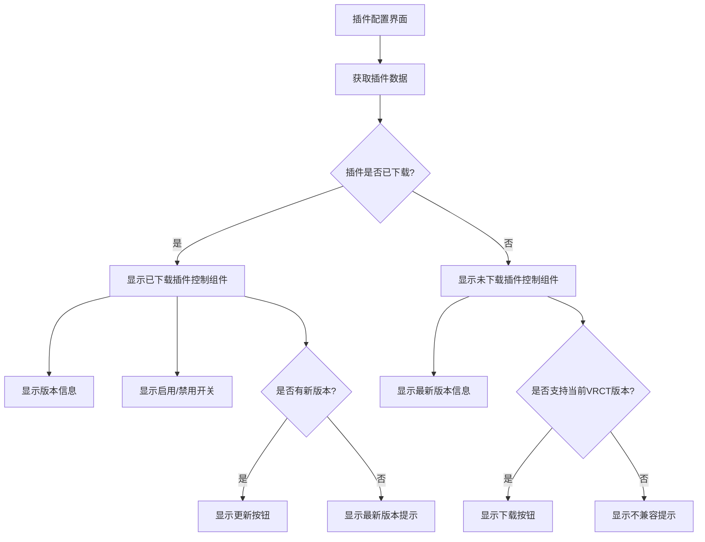
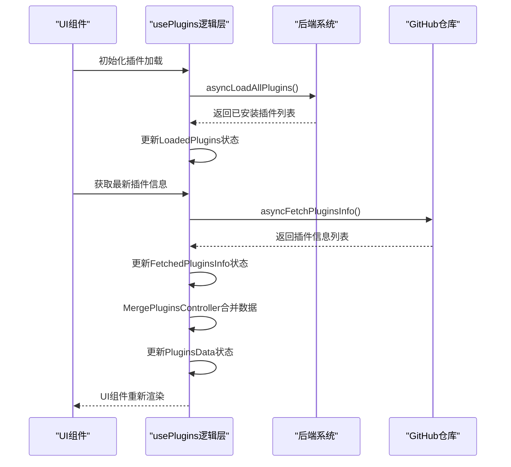
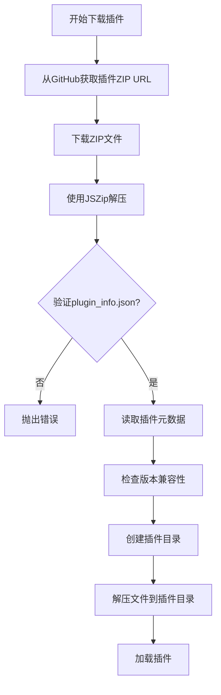
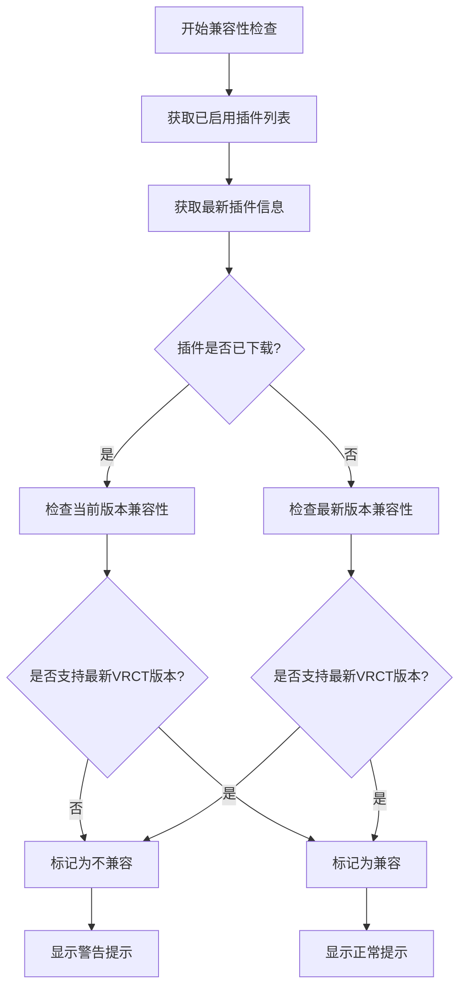
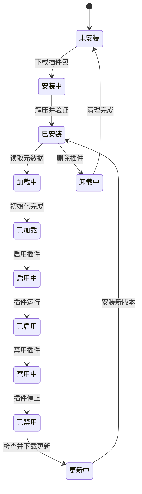

# 插件管理

<cite>
**本文档引用的文件**
- [Plugins.jsx](file://src-ui/views/app/config_page/setting_section/setting_box/plugins/Plugins.jsx)
- [usePlugins.js](file://src-ui/logics/configs/config_page_setter/plugins/usePlugins.js)
- [PluginsControlComponent.jsx](file://src-ui/views/app/config_page/setting_section/setting_box/plugins/plugins_control_component/PluginsControlComponent.jsx)
- [MergePluginsController.jsx](file://src-ui/views/app/_app_controllers/plugins_controllers/MergePluginsController.jsx)
- [LoadPluginsController.jsx](file://src-ui/views/app/_app_controllers/plugins_controllers/LoadPluginsController.jsx)
- [FetchLatestPluginsDataController.jsx](file://src-ui/views/app/_app_controllers/plugins_controllers/FetchLatestPluginsDataController.jsx)
- [store.js](file://src-ui/logics/store.js)
- [vrct_capability.json](file://src-tauri/capabilities/vrct_capability.json)
- [PluginCompatibilityList.jsx](file://src-ui/views/app/others/modal_controller/update_modal/plugins_compatibility_list/PluginCompatibilityList.jsx)
- [UpdateModal.jsx](file://src-ui/views/app/others/modal_controller/update_modal/UpdateModal.jsx)
</cite>

## 目录
1. [插件配置界面](#插件配置界面)
2. [插件逻辑层与后端通信](#插件逻辑层与后端通信)
3. [插件安装包验证与沙箱执行](#插件安装包验证与沙箱执行)
4. [权限控制模型](#权限控制模型)
5. [插件冲突检测与兼容性提示](#插件冲突检测与兼容性提示)
6. [插件生命周期管理](#插件生命周期管理)

## 插件配置界面

插件配置界面提供了对已安装插件的全面管理功能，包括列表展示、启用/禁用控制、更新检查和第三方插件源管理。界面通过 `Plugins.jsx` 组件实现，该组件位于 `src-ui/views/app/config_page/setting_section/setting_box/plugins/` 目录下。

界面主要功能包括：
- **已安装插件列表展示**：以卡片形式展示所有插件，包括插件名称、描述和主页链接
- **启用/禁用控制**：通过开关组件控制插件的启用状态
- **更新检查**：自动检查插件是否有新版本可用，并提供更新提示
- **第三方插件源管理**：通过中央插件列表管理第三方插件源

插件列表根据插件ID进行字母顺序排序，并过滤掉已过时的插件。对于每个插件，界面会根据其状态（已下载、未下载、已过时等）显示不同的控制组件。



**图示来源**
- [Plugins.jsx](file://src-ui/views/app/config_page/setting_section/setting_box/plugins/Plugins.jsx#L1-L128)
- [PluginsControlComponent.jsx](file://src-ui/views/app/config_page/setting_section/setting_box/plugins/plugins_control_component/PluginsControlComponent.jsx#L1-L156)

**本节来源**
- [Plugins.jsx](file://src-ui/views/app/config_page/setting_section/setting_box/plugins/Plugins.jsx#L1-L128)

## 插件逻辑层与后端通信

插件系统的核心逻辑层由 `usePlugins.js` 文件实现，该文件位于 `src-ui/logics/configs/config_page_setter/plugins/` 目录下。该逻辑层负责与后端插件系统通信，获取插件元数据和运行状态。

### 通信机制

插件逻辑层通过以下方式与后端系统通信：

1. **Tauri API调用**：使用 `@tauri-apps/api/core` 的 `invoke` 函数与Rust后端通信
2. **文件系统操作**：使用 `@tauri-apps/plugin-fs` 进行插件文件的读写操作
3. **HTTP请求**：通过 `asyncTauriFetchGithub` 函数从GitHub获取插件信息

### 数据流

插件系统的数据流遵循以下流程：

1. **初始化**：应用启动时，`LoadPluginsController` 组件调用 `asyncLoadAllPlugins` 加载所有已安装插件
2. **获取最新信息**：`FetchLatestPluginsDataController` 组件调用 `asyncFetchPluginsInfo` 从中央插件列表获取最新插件信息
3. **数据合并**：`MergePluginsController` 组件将已安装插件、最新插件信息和保存的插件状态进行合并
4. **状态更新**：合并后的数据通过Jotai状态管理库更新到UI组件



**图示来源**
- [usePlugins.js](file://src-ui/logics/configs/config_page_setter/plugins/usePlugins.js#L1-L469)
- [LoadPluginsController.jsx](file://src-ui/views/app/_app_controllers/plugins_controllers/LoadPluginsController.jsx#L1-L26)
- [FetchLatestPluginsDataController.jsx](file://src-ui/views/app/_app_controllers/plugins_controllers/FetchLatestPluginsDataController.jsx#L1-L17)
- [MergePluginsController.jsx](file://src-ui/views/app/_app_controllers/plugins_controllers/MergePluginsController.jsx#L1-L205)

**本节来源**
- [usePlugins.js](file://src-ui/logics/configs/config_page_setter/plugins/usePlugins.js#L1-L469)

## 插件安装包验证与沙箱执行

插件系统实现了严格的安装包验证机制和沙箱执行策略，确保插件的安全性。

### 安装包验证机制

插件安装包的验证主要通过以下方式实现：

1. **元数据验证**：检查 `plugin_info.json` 文件是否存在且包含必要字段
2. **版本兼容性检查**：验证插件支持的VRCT版本范围
3. **文件完整性检查**：在解压过程中验证文件的完整性



### 沙箱执行策略

插件在沙箱环境中执行，主要通过以下机制实现：

1. **代码转换**：使用Babel将插件代码转换为ES模块格式
2. **Blob URL**：将转换后的代码创建为Blob URL并动态导入
3. **作用域隔离**：为每个插件创建独立的执行上下文

```javascript
// 代码转换和沙箱执行的核心逻辑
const transpiled_code = transform(cleaned_code, {
    presets: [
        ["env", { modules: false }],
        "react",
    ],
    sourceType: "module"
}).code;
const blob = new Blob([transpiled_code], { type: "text/javascript" });
const blob_url = URL.createObjectURL(blob);
const plugin_module = await import(/* @vite-ignore */ blob_url);
URL.revokeObjectURL(blob_url);
```

**图示来源**
- [usePlugins.js](file://src-ui/logics/configs/config_page_setter/plugins/usePlugins.js#L140-L205)
- [vrct_capability.json](file://src-tauri/capabilities/vrct_capability.json#L38-L63)

**本节来源**
- [usePlugins.js](file://src-ui/logics/configs/config_page_setter/plugins/usePlugins.js#L77-L107)

## 权限控制模型

插件系统的权限控制模型通过Tauri的能力系统实现，确保插件只能访问必要的资源。

### 能力配置

`vrct_capability.json` 文件定义了插件系统的权限范围：

1. **文件系统权限**：仅允许访问 `$RESOURCE/plugins/**` 目录
2. **网络权限**：仅允许访问特定的GitHub API和资源URL
3. **进程执行权限**：仅允许执行特定的sidecar程序

```json
{
    "permissions": [
        "fs:allow-write-file",
        "fs:allow-remove",
        "fs:allow-resource-read-recursive",
        "fs:allow-resource-meta-recursive",
        {
            "identifier": "fs:scope",
            "allow": [
                { "path": "$RESOURCE/plugins/**" },
                { "path": "src-tauri/target/debug/plugins/**" }
            ]
        },
        {
            "identifier": "http:default",
            "allow": [
                { "url": "https://api.github.com/repos/**" },
                { "url": "https://github.com/**" },
                { "url": "https://raw.githubusercontent.com/ShiinaSakamoto/vrct_plugins_list/main/vrct_plugins_list.json" }
            ]
        }
    ]
}
```

### 插件上下文权限

插件在初始化时通过 `generatePluginContext` 函数获得有限的权限：

1. **组件注册权限**：允许注册UI组件
2. **状态管理权限**：允许创建和使用原子状态
3. **日志记录权限**：允许记录错误信息

```javascript
const generatePluginContext = (downloaded_plugin_info) => {
    const plugin_context = {
        registerComponent: (component) => { /* ... */ },
        createAtomWithHook: (...args) => createAtomWithHook(...args),
        logics: { ...logics_common, ...logics_configs, ...logics_main },
        i18n: i18n,
    };
    return plugin_context;
}
```

**图示来源**
- [vrct_capability.json](file://src-tauri/capabilities/vrct_capability.json#L1-L63)
- [usePlugins.js](file://src-ui/logics/configs/config_page_setter/plugins/usePlugins.js#L53-L75)

**本节来源**
- [vrct_capability.json](file://src-tauri/capabilities/vrct_capability.json#L1-L63)

## 插件冲突检测与兼容性提示

插件系统实现了完善的冲突检测和兼容性提示机制，帮助用户管理插件的兼容性问题。

### 冲突检测机制

系统通过以下方式检测插件冲突：

1. **版本兼容性检查**：检查插件支持的VRCT版本范围
2. **依赖关系检查**：通过插件元数据检查插件间的依赖关系
3. **运行时冲突检测**：监控插件运行时的错误和异常

### 兼容性提示实现

兼容性提示主要通过 `PluginCompatibilityList` 组件实现：

1. **兼容性检查**：比较已安装插件和最新插件的版本兼容性
2. **状态分类**：将插件分为兼容和不兼容两类
3. **用户提示**：向用户显示详细的兼容性信息



当检测到不兼容的插件时，系统会在软件更新前向用户显示警告，提示这些插件在更新后将被禁用。

**图示来源**
- [PluginCompatibilityList.jsx](file://src-ui/views/app/others/modal_controller/update_modal/plugins_compatibility_list/PluginCompatibilityList.jsx#L1-L78)
- [UpdateModal.jsx](file://src-ui/views/app/others/modal_controller/update_modal/UpdateModal.jsx#L1-L100)

**本节来源**
- [PluginCompatibilityList.jsx](file://src-ui/views/app/others/modal_controller/update_modal/plugins_compatibility_list/PluginCompatibilityList.jsx#L1-L78)

## 插件生命周期管理

插件系统提供了完整的生命周期管理功能，允许用户安全地管理插件的整个生命周期。

### 生命周期阶段

插件的生命周期包括以下阶段：

1. **安装**：从GitHub下载并解压插件包
2. **加载**：读取插件元数据并初始化插件
3. **启用/禁用**：控制插件的运行状态
4. **更新**：下载并安装新版本插件
5. **卸载**：删除插件文件和相关数据

### 状态管理

插件状态通过Jotai状态管理库进行管理，主要包括以下状态：

- `SavedPluginsStatus`：保存的插件启用状态
- `LoadedPlugins`：已加载的插件列表
- `FetchedPluginsInfo`：从远程获取的插件信息
- `PluginsData`：合并后的插件数据



### 用户界面交互

用户通过插件配置界面与插件生命周期进行交互：

1. **安装**：点击"下载"按钮开始安装过程
2. **启用/禁用**：切换开关控制插件状态
3. **更新**：当有新版本可用时，点击"更新"按钮
4. **查看状态**：界面实时显示插件的当前状态

**图示来源**
- [usePlugins.js](file://src-ui/logics/configs/config_page_setter/plugins/usePlugins.js#L285-L359)
- [store.js](file://src-ui/logics/store.js#L238-L241)

**本节来源**
- [usePlugins.js](file://src-ui/logics/configs/config_page_setter/plugins/usePlugins.js#L285-L359)