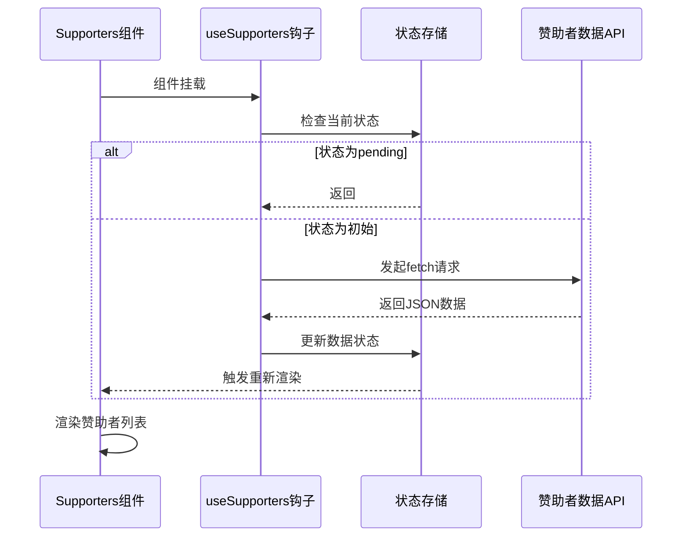
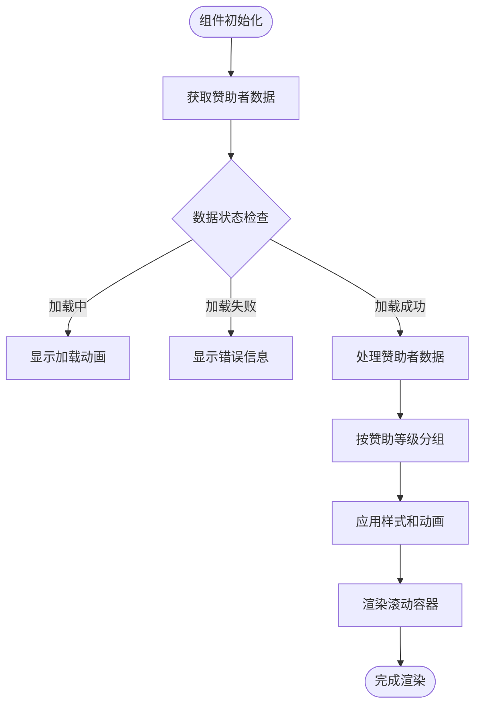
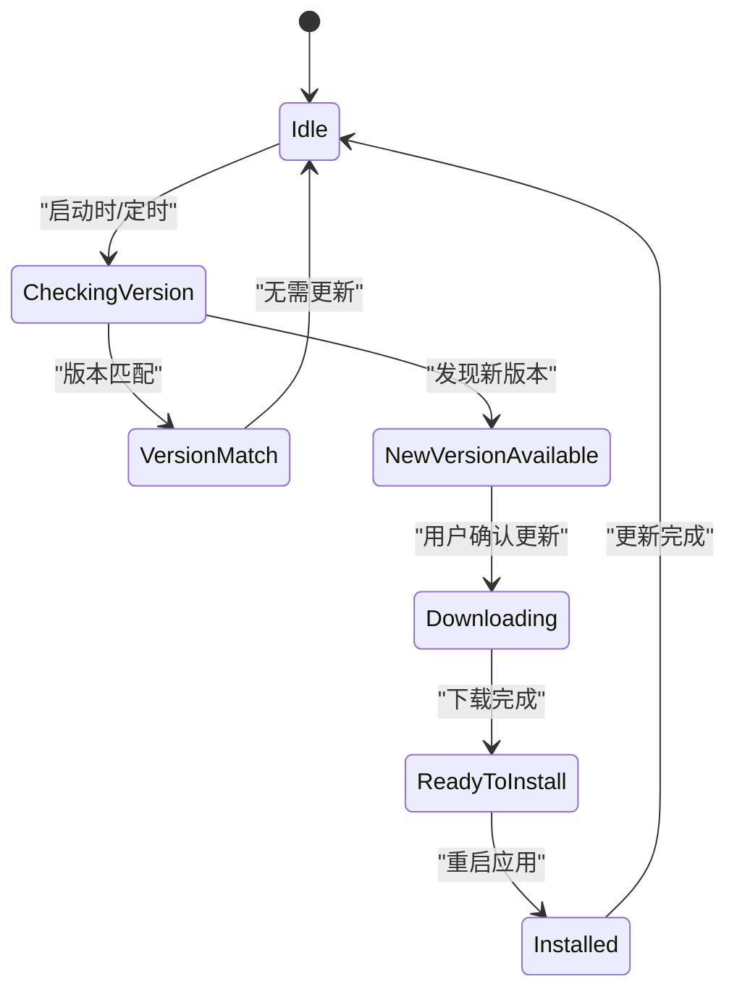
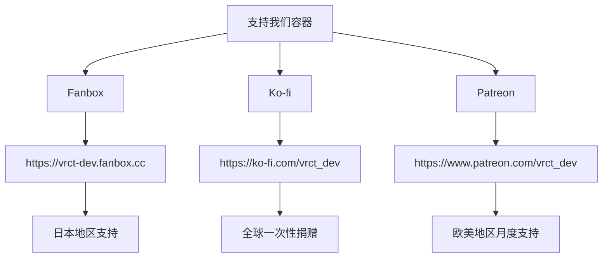

# 支持与关于

<cite>
**本文档中引用的文件**
- [Supporters.jsx](file://src-ui/views/app/config_page/setting_section/setting_box/supporters/Supporters.jsx)
- [useSupporters.js](file://src-ui/logics/configs/config_page_setter/supporters/useSupporters.js)
- [SupportersContainer.jsx](file://src-ui/views/app/config_page/setting_section/setting_box/supporters/supporters_container/SupportersContainer.jsx)
- [SupportUsContainer.jsx](file://src-ui/views/app/config_page/setting_section/setting_box/supporters/support_us_container/SupportUsContainer.jsx)
- [SupportersWrapper.jsx](file://src-ui/views/app/config_page/setting_section/setting_box/supporters/supporters_container/supporters_wrapper/SupportersWrapper.jsx)
- [AboutVrct.jsx](file://src-ui/views/app/config_page/setting_section/setting_box/about_vrct/AboutVrct.jsx)
- [ui_configs.js](file://src-ui/ui_configs.js)
</cite>

## 目录
1. [介绍](#介绍)
2. [项目版本与许可证信息](#项目版本与许可证信息)
3. [赞助者支持功能实现](#赞助者支持功能实现)
4. [关于页面功能分析](#关于页面功能分析)
5. [外部平台集成与隐私保护](#外部平台集成与隐私保护)
6. [社区支持与宣传素材](#社区支持与宣传素材)

## 介绍

本项目VRCT（Virtual Reality Chat Translator）是一个为虚拟现实环境设计的实时聊天翻译工具，旨在帮助不同语言背景的用户在VR空间中无障碍交流。本文档重点介绍项目的"支持与关于"功能模块，包括赞助者支持系统、版本信息展示、开源许可证说明以及社区参与渠道。通过分析核心组件的实现机制，阐述系统如何动态加载赞助者数据、实现滚动展示效果，以及版本检查和更新提示逻辑。

## 项目版本与许可证信息

VRCT项目遵循开源软件的原则，其版本信息和许可证条款在"关于"页面中清晰展示。项目使用Tauri框架构建跨平台桌面应用，结合Python后端处理语音识别和翻译任务。在`AboutVrct.jsx`组件中，系统通过`useSoftwareVersion`钩子获取当前软件版本，并与远程服务器上的最新版本进行比较，实现自动更新检测功能。

项目采用MIT许可证，允许用户自由使用、复制、修改和分发软件，同时保留原作者的版权声明和许可声明。在"关于"页面中，用户可以查看完整的许可证文本，了解自己的权利和义务。此外，页面还展示了项目的核心技术栈，包括React前端框架、Tauri应用框架和Python机器学习库，为开发者提供技术参考。

**Section sources**
- [AboutVrct.jsx](file://src-ui/views/app/config_page/setting_section/setting_box/about_vrct/AboutVrct.jsx)
- [ui_configs.js](file://src-ui/ui_configs.js)

## 赞助者支持功能实现

### 赞助者数据动态加载机制

VRCT的赞助者支持功能通过`useSupporters`自定义钩子实现数据的动态加载和状态管理。该钩子位于`src-ui/logics/configs/config_page_setter/supporters/useSupporters.js`，利用React的`useStore_SupportersData`状态管理机制，维护赞助者数据的获取状态（pending）、错误状态（error）和当前数据（current）。

**Diagram sources**
- [useSupporters.js](file://src-ui/logics/configs/config_page_setter/supporters/useSupporters.js)
- [Supporters.jsx](file://src-ui/views/app/config_page/setting_section/setting_box/supporters/Supporters.jsx)

**Section sources**
- [useSupporters.js](file://src-ui/logics/configs/config_page_setter/supporters/useSupporters.js)

### 滚动展示效果实现

赞助者名单的滚动展示效果通过`SupportersWrapper`组件实现。该组件从状态存储中获取赞助者数据，根据赞助等级（如"fuwa"、"mochi"、"mogu"）对赞助者进行分类，并应用不同的样式。系统使用CSS模块化样式（SupportersWrapper.module.scss）定义滚动动画，通过`overflow-x: auto`和`white-space: nowrap`实现水平滚动效果。

赞助者头像和名称以卡片形式水平排列，每个卡片根据赞助等级应用不同的边框颜色和装饰效果。滚动容器支持鼠标滚轮和触摸板手势操作，确保在不同设备上都有良好的用户体验。此外，系统还实现了响应式设计，根据窗口大小自动调整卡片尺寸和间距。

**Diagram sources**
- [SupportersContainer.jsx](file://src-ui/views/app/config_page/setting_section/setting_box/supporters/supporters_container/SupportersContainer.jsx)
- [SupportersWrapper.jsx](file://src-ui/views/app/config_page/setting_section/setting_box/supporters/supporters_container/supporters_wrapper/SupportersWrapper.jsx)

**Section sources**
- [SupportersContainer.jsx](file://src-ui/views/app/config_page/setting_section/setting_box/supporters/supporters_container/SupportersContainer.jsx)
- [SupportersWrapper.jsx](file://src-ui/views/app/config_page/setting_section/setting_box/supporters/supporters_container/supporters_wrapper/SupportersWrapper.jsx)

## 关于页面功能分析

### 版本检查机制

`AboutVrct.jsx`组件实现了完整的版本检查机制，通过定期向版本检查API发起请求，获取最新的软件版本信息。系统使用`useIsSoftwareUpdating`和`useUpdateSoftware`钩子管理更新状态，当检测到新版本时，会在UI上显示更新提示。

版本检查过程包含以下步骤：首先获取当前安装版本号，然后向远程服务器发送版本查询请求，比较本地版本与远程版本号。如果远程版本较新，则触发更新流程，下载更新包并提示用户重启应用完成更新。整个过程在后台静默进行，不影响用户正常使用。

**Diagram sources**
- [AboutVrct.jsx](file://src-ui/views/app/config_page/setting_section/setting_box/about_vrct/AboutVrct.jsx)

**Section sources**
- [AboutVrct.jsx](file://src-ui/views/app/config_page/setting_section/setting_box/about_vrct/AboutVrct.jsx)

### 更新提示逻辑

更新提示逻辑设计注重用户体验，避免频繁打扰用户。系统采用渐进式提示策略：首次检测到更新时，在设置页面显示不显眼的更新图标；当用户进入关于页面时，才显示详细的更新信息和更新按钮。对于重要安全更新，系统会提升提示优先级，可能在应用启动时显示模态对话框。

提示内容包含新版本的变更日志、更新大小和预计下载时间，帮助用户决定是否立即更新。系统还支持延迟更新功能，允许用户选择在下次启动时更新，确保当前工作流程不被中断。所有更新操作都经过数字签名验证，确保下载包的完整性和安全性。

## 外部平台集成与隐私保护

### 多平台捐赠渠道集成

VRCT通过`SupportUsContainer`组件集成了多个外部支持平台，包括Patreon、Fanbox和Ko-fi。这些平台为不同地区的用户提供多样化的捐赠选择。组件使用静态导入的方式加载各平台的logo图像，并通过安全的HTTPS链接跳转到对应的捐赠页面。

**Diagram sources**
- [SupportUsContainer.jsx](file://src-ui/views/app/config_page/setting_section/setting_box/supporters/support_us_container/SupportUsContainer.jsx)

**Section sources**
- [SupportUsContainer.jsx](file://src-ui/views/app/config_page/setting_section/setting_box/supporters/support_us_container/SupportUsContainer.jsx)

### 用户隐私保护措施

项目高度重视用户隐私保护，所有外部链接均在新窗口中打开，并添加`rel="noreferrer"`属性，防止目标网站获取来源页面信息。系统不收集或存储用户的捐赠信息，所有交易都在第三方平台完成。赞助者名单的展示遵循最小化原则，仅显示用户公开的赞助者名称和等级，不包含任何个人身份信息。

此外，数据获取请求使用标准的`fetch` API，不包含任何用户追踪代码。赞助者数据API返回的内容经过严格过滤，确保不包含敏感信息。前端代码中所有外部资源链接都使用相对路径或配置常量，便于统一管理和安全审计。

## 社区支持与宣传素材

### 贡献者名单管理

贡献者名单通过GitHub的API动态获取，展示项目的核心开发团队和主要贡献者。系统定期同步GitHub上的贡献者数据，按照贡献次数排序，并为每位贡献者显示GitHub头像和用户名。这种透明的贡献者展示机制鼓励社区参与，让用户的贡献得到应有的认可。

### 宣传素材访问方式

项目提供丰富的宣传素材供社区使用，包括不同尺寸的logo、宣传图和视频演示。这些素材存放在项目的`assets`目录中，通过专门的下载链接提供。用户可以在"关于"页面找到这些资源的访问入口，用于制作教程、推广文章或社交媒体内容。

社区支持渠道包括GitHub Issues用于问题报告、GitHub Discussions用于功能讨论，以及Discord服务器用于实时交流。这些渠道的链接都在应用内清晰展示，降低新用户参与社区的门槛。项目还维护详细的文档和FAQ，帮助用户快速解决问题。

**Section sources**
- [ui_configs.js](file://src-ui/ui_configs.js)
- [Supporters.jsx](file://src-ui/views/app/config_page/setting_section/setting_box/supporters/Supporters.jsx)