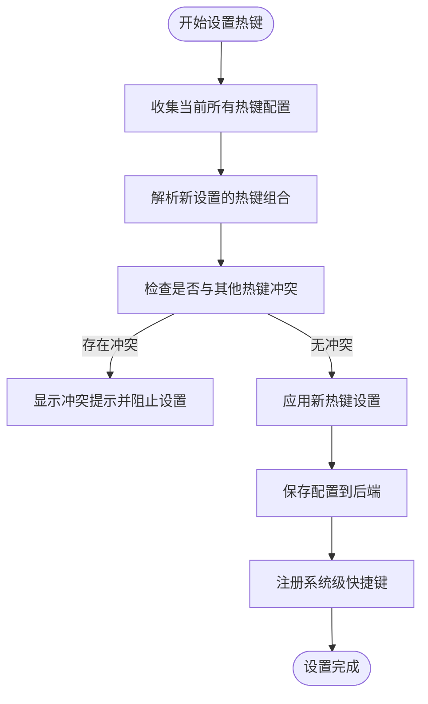
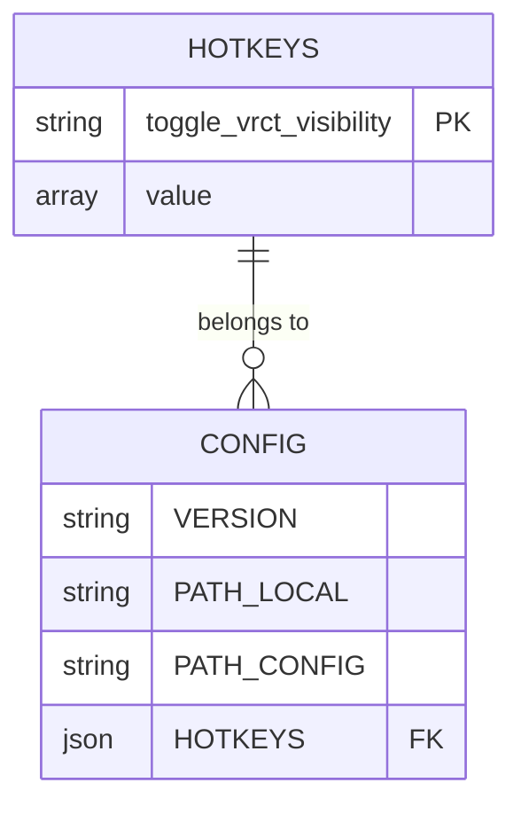
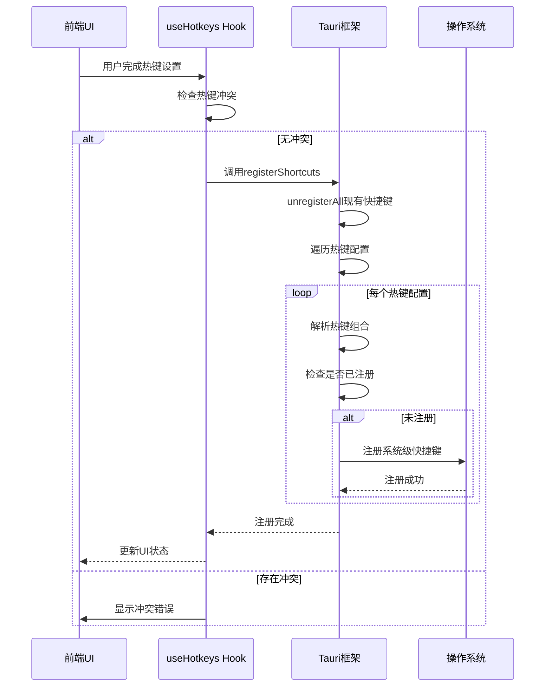
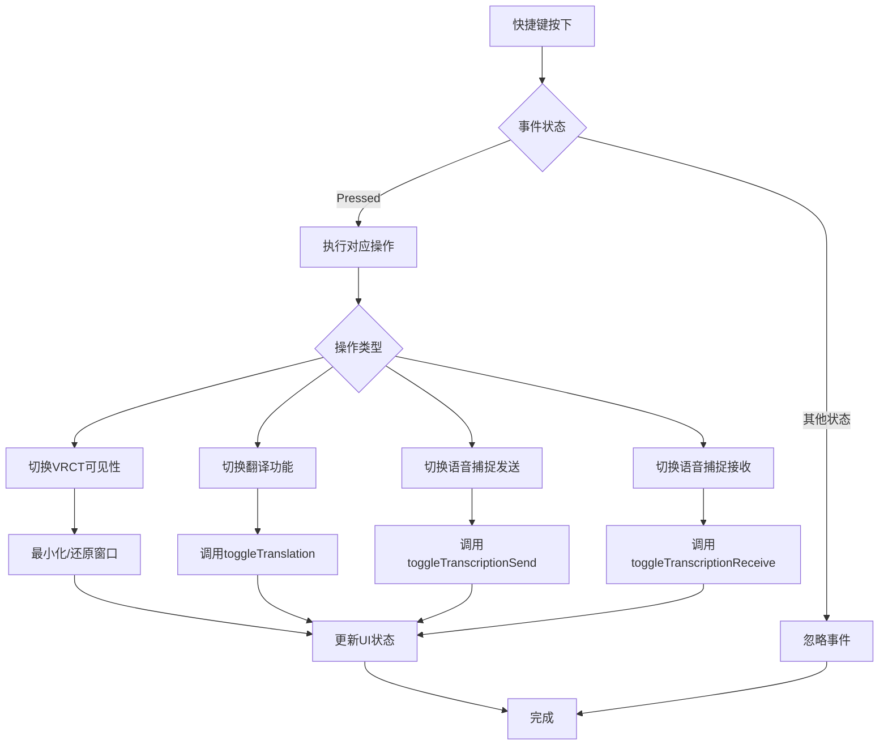
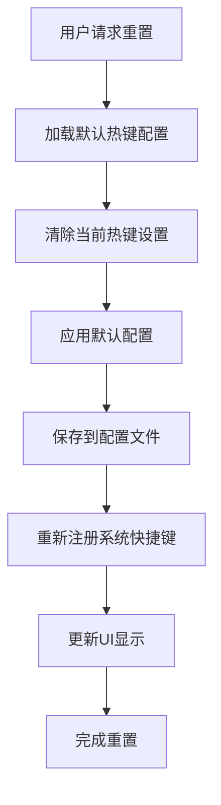
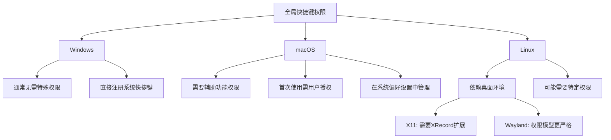

# 热键设置

<cite>
**本文档引用的文件**   
- [useHotkeys.js](file://src-ui/logics/configs/config_page_setter/hotkeys/useHotkeys.js)
- [HotkeysEntry.jsx](file://src-ui/views/app/config_page/setting_section/setting_box/_components/hotkeys_entry/HotkeysEntry.jsx)
- [Hotkeys.jsx](file://src-ui/views/app/config_page/setting_section/setting_box/hotkeys/Hotkeys.jsx)
- [GlobalHotKeyController.jsx](file://src-ui/views/app/_app_controllers/GlobalHotKeyController.jsx)
- [KeyEventController.jsx](file://src-ui/views/app/_app_controllers/KeyEventController.jsx)
- [config.py](file://src-python/config.py)
- [controller.py](file://src-python/controller.py)
- [lib.rs](file://src-tauri/src/lib.rs)
</cite>

## 目录
1. [热键配置机制](#热键配置机制)
2. [热键冲突检测与处理](#热键冲突检测与处理)
3. [热键序列化存储格式](#热键序列化存储格式)
4. [系统级快捷键注册](#系统级快捷键注册)
5. [热键事件处理逻辑](#热键事件处理逻辑)
6. [热键诊断与重置功能](#热键诊断与重置功能)
7. [跨平台权限差异](#跨平台权限差异)

## 热键配置机制

VRCT应用的全局热键配置机制通过前端UI组件与后端Python控制器的协同工作实现。热键配置功能主要由`HotkeysEntry`组件负责，该组件位于`src-ui/views/app/config_page/setting_section/setting_box/_components/hotkeys_entry/`目录下，是用户配置语音捕捉开关、翻译启停、界面显示/隐藏等快捷键的主要交互界面。

热键配置系统支持多种功能的快捷键设置，包括：
- 界面显示/隐藏切换（toggle_vrct_visibility）
- 翻译功能启停（toggle_translation）
- 语音捕捉发送开关（toggle_transcription_send）
- 语音捕捉接收开关（toggle_transcription_receive）

前端通过`useHotkeys`自定义Hook管理热键状态和逻辑，该Hook封装了与后端通信、热键注册、冲突检测等核心功能。当用户在UI上配置热键时，系统会实时捕获键盘事件并进行处理，确保用户能够直观地设置所需的快捷键组合。

**Section sources**
- [HotkeysEntry.jsx](file://src-ui/views/app/config_page/setting_section/setting_box/_components/hotkeys_entry/HotkeysEntry.jsx#L1-L122)
- [Hotkeys.jsx](file://src-ui/views/app/config_page/setting_section/setting_box/hotkeys/Hotkeys.jsx#L1-L49)
- [useHotkeys.js](file://src-ui/logics/configs/config_page_setter/hotkeys/useHotkeys.js#L7-L122)

## 热键冲突检测与处理

热键系统实现了完善的冲突检测机制，确保用户设置的快捷键不会相互冲突。当用户尝试设置热键时，系统会执行以下冲突检测流程：

**Diagram sources**
- [useHotkeys.js](file://src-ui/logics/configs/config_page_setter/hotkeys/useHotkeys.js#L25-L53)

在`useHotkeys.js`文件中，`setHotkeys`函数负责处理热键设置和冲突检测。该函数通过创建一个`usedShortcuts`集合来跟踪已使用的快捷键，当检测到冲突时，会通过通知系统向用户显示错误信息"该热键已被使用"，并阻止冲突的热键设置。

热键冲突检测的关键代码逻辑包括：
1. 遍历所有热键配置项
2. 将每个热键组合解析为标准化格式
3. 使用Set数据结构检查重复
4. 发现冲突时更新UI状态并通知用户

这种机制确保了用户无法设置重复的快捷键，维护了热键系统的完整性和可用性。

**Section sources**
- [useHotkeys.js](file://src-ui/logics/configs/config_page_setter/hotkeys/useHotkeys.js#L25-L53)

## 热键序列化存储格式

热键配置的序列化存储采用JSON格式，通过`config.py`文件中的`HOTKEYS`属性进行管理。该属性使用`ValidatedProperty`描述符确保数据结构的完整性和有效性。

热键配置的存储格式为字典结构，其中键为功能标识符，值为快捷键组合数组：

**Diagram sources**
- [config.py](file://src-python/config.py#L650-L657)
- [config.py](file://src-python/config.py#L867-L882)

在`config.py`文件中，`HOTKEYS`属性的定义确保了热键配置数据的结构化存储和验证。系统在初始化时会设置默认的热键配置，包括：

- toggle_vrct_visibility: ["Ctrl", "Shift", "T"]
- toggle_translation: ["Ctrl", "Shift", "L"]
- toggle_transcription_send: ["Ctrl", "Shift", "S"]
- toggle_transcription_receive: ["Ctrl", "Shift", "R"]

这些默认配置存储在`_HOTKEYS`私有属性中，并通过`ValidatedProperty`进行访问控制和数据验证。当用户修改热键设置时，系统会立即保存到`config.json`文件中，实现配置的持久化。

热键的序列化过程还包括对修饰键的标准化处理，将"Ctrl"、"Alt"、"Shift"、"Meta"等键映射为系统标准名称，确保跨平台一致性。

**Section sources**
- [config.py](file://src-python/config.py#L650-L657)
- [config.py](file://src-python/config.py#L867-L882)

## 系统级快捷键注册

系统级快捷键的注册通过Tauri框架的`global-shortcut`插件实现，该插件提供了跨平台的全局快捷键支持。注册过程由前端控制器和后端Python代码协同完成。

**Diagram sources**
- [useHotkeys.js](file://src-ui/logics/configs/config_page_setter/hotkeys/useHotkeys.js#L56-L107)
- [lib.rs](file://src-tauri/src/lib.rs#L17)
- [GlobalHotKeyController.jsx](file://src-ui/views/app/_app_controllers/GlobalHotKeyController.jsx#L5-L25)

在`src-tauri/src/lib.rs`文件中，通过`plugin(tauri_plugin_global_shortcut::Builder::new().build())`注册了全局快捷键插件，为前端提供了系统级快捷键支持。前端通过`@tauri-apps/plugin-global-shortcut`包的`register`、`unregisterAll`和`isRegistered`函数与原生功能交互。

`GlobalHotKeyController`组件负责管理快捷键的生命周期，当应用状态满足条件（VRCT可用、后端就绪且不在更新中）时，自动调用`registerShortcuts`注册所有配置的快捷键；否则调用`unregisterAll`注销所有快捷键，避免在不适当的状态下响应快捷键。

**Section sources**
- [useHotkeys.js](file://src-ui/logics/configs/config_page_setter/hotkeys/useHotkeys.js#L56-L107)
- [lib.rs](file://src-tauri/src/lib.rs#L17)
- [GlobalHotKeyController.jsx](file://src-ui/views/app/_app_controllers/GlobalHotKeyController.jsx#L5-L25)

## 热键事件处理逻辑

热键事件的处理逻辑分布在前端和后端两个层面，通过清晰的职责分离实现高效的功能响应。前端负责快捷键的注册和基本事件处理，后端Python代码负责执行具体的功能逻辑。

**Diagram sources**
- [useHotkeys.js](file://src-ui/logics/configs/config_page_setter/hotkeys/useHotkeys.js#L69-L98)

在`useHotkeys.js`文件中，`registerShortcuts`函数为每个注册的快捷键设置了事件处理器。处理器首先检查事件状态是否为"Pressed"，以确保只在按键按下时触发操作，避免重复执行。

不同的热键操作通过`switch`语句分发到相应的处理函数：
- `toggle_vrct_visibility`：控制应用窗口的最小化和还原
- `toggle_translation`：调用`toggleTranslation`函数切换翻译功能
- `toggle_transcription_send`：调用`toggleTranscriptionSend`函数控制语音捕捉发送
- `toggle_transcription_receive`：调用`toggleTranscriptionReceive`函数控制语音捕捉接收

这些处理函数通过React Hook从`useMainFunction`导入，实现了功能逻辑与热键配置的解耦。当快捷键触发时，相应的功能状态会被切换，并通过状态管理更新UI界面。

**Section sources**
- [useHotkeys.js](file://src-ui/logics/configs/config_page_setter/hotkeys/useHotkeys.js#L69-L98)

## 热键诊断与重置功能

热键系统提供了完整的诊断和重置功能，帮助用户解决快捷键配置问题。这些功能通过前端UI和后端逻辑的协同工作实现，确保用户能够轻松管理和恢复热键设置。

诊断功能主要包括：
- 热键冲突检测
- 重复快捷键识别
- 无效快捷键验证
- 系统级注册状态检查

重置功能允许用户将热键配置恢复到默认状态，当用户遇到配置问题或希望重新开始时非常有用。系统通过以下流程实现重置：

**Diagram sources**
- [useHotkeys.js](file://src-ui/logics/configs/config_page_setter/hotkeys/useHotkeys.js#L25-L53)
- [config.py](file://src-python/config.py#L867-L882)

在`useHotkeys.js`中，`setHotkeys`函数不仅处理用户自定义设置，还为重置功能提供了基础支持。当需要重置时，系统会加载`config.py`中定义的默认热键配置，并通过相同的保存和注册流程应用这些默认值。

诊断信息通过通知系统向用户展示，包括具体的冲突快捷键和建议的解决方案。这种设计确保了用户能够理解问题所在并采取适当的纠正措施。

**Section sources**
- [useHotkeys.js](file://src-ui/logics/configs/config_page_setter/hotkeys/useHotkeys.js#L25-L53)
- [config.py](file://src-python/config.py#L867-L882)

## 跨平台权限差异

热键系统在不同操作系统下存在权限差异，这些差异通过Tauri框架的抽象层进行处理，确保了跨平台的一致性体验。不同操作系统的权限要求和实现方式有所不同：

**Diagram sources**
- [lib.rs](file://src-tauri/src/lib.rs#L17)
- [package-lock.json](file://package-lock.json#L2244-L2247)
- [Cargo.lock](file://src-tauri/Cargo.lock#L4317-L4320)

在`src-tauri/src/lib.rs`中，通过集成`tauri-plugin-global-shortcut`插件，系统能够自动处理不同平台的权限要求。该插件基于`global-hotkey` Rust crate，为各平台提供了统一的API接口。

对于macOS系统，由于安全限制，应用需要用户明确授权才能监听全局快捷键。Tauri框架会自动提示用户在系统偏好设置中授予必要的辅助功能权限。一旦获得授权，快捷键功能即可正常工作。

在Linux系统上，快捷键支持依赖于具体的桌面环境和显示服务器（X11或Wayland）。Tauri的`global-shortcut`插件通过`global-hotkey`库处理这些差异，尽可能提供一致的用户体验。

Windows系统通常对全局快捷键的限制较少，大多数情况下可以直接注册和使用，无需额外的用户授权步骤。

**Section sources**
- [lib.rs](file://src-tauri/src/lib.rs#L17)
- [package-lock.json](file://package-lock.json#L2244-L2247)
- [Cargo.lock](file://src-tauri/Cargo.lock#L4317-L4320)