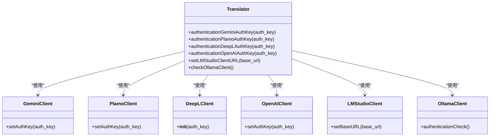
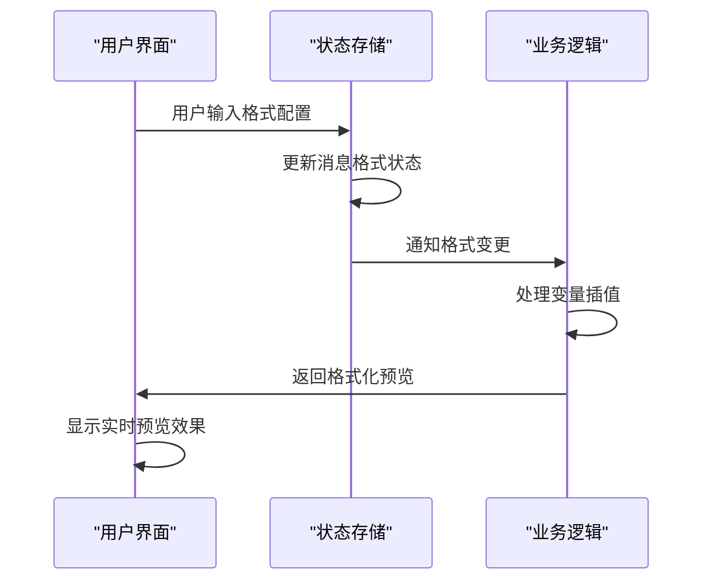
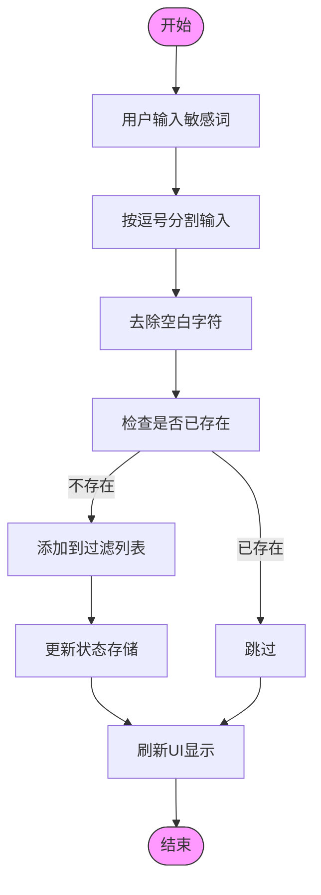
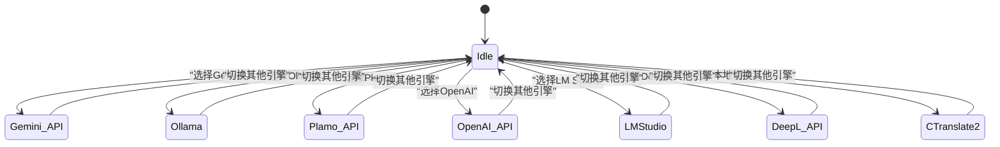
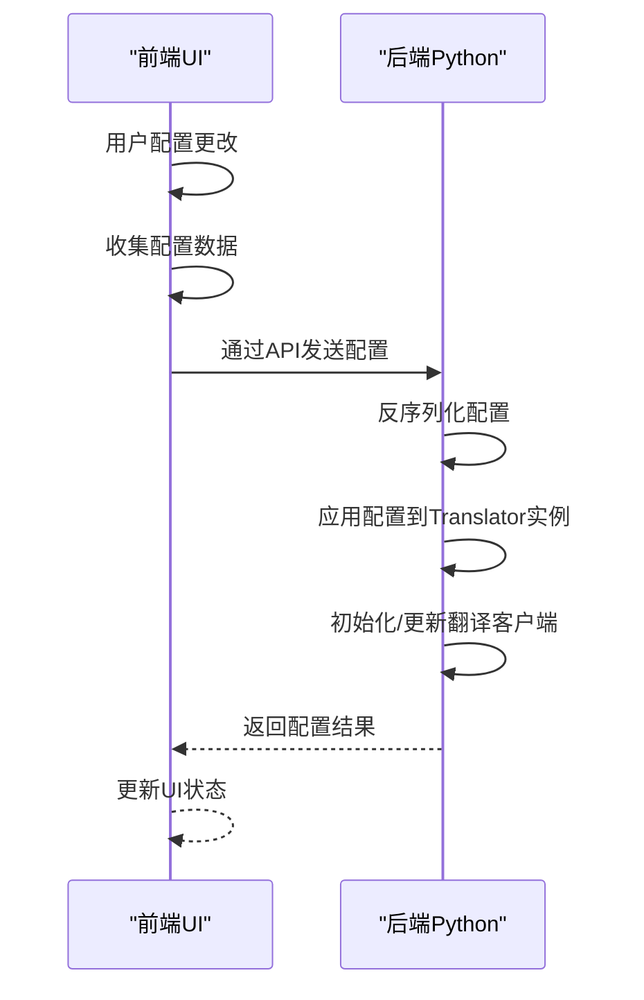

# 翻译设置

<cite>
**本文档中引用的文件**  
- [MessageFormat.jsx](file://src-ui/views/app/config_page/setting_section/setting_box/_components/message_format/MessageFormat.jsx)
- [WordFilter.jsx](file://src-ui/views/app/config_page/setting_section/setting_box/_components/word_filter/WordFilter.jsx)
- [Translation.jsx](file://src-ui/views/app/config_page/setting_section/setting_box/translation/Translation.jsx)
- [translation_translator.py](file://src-python/models/translation/translation_translator.py)
- [languages.yml](file://src-python/models/translation/languages/languages.yml)
- [translation_gemini.yml](file://src-python/models/translation/prompt/translation_gemini.yml)
</cite>

## 目录
1. [翻译引擎配置流程](#翻译引擎配置流程)
2. [API密钥管理](#api密钥管理)
3. [消息格式模板](#消息格式模板)
4. [敏感词过滤规则](#敏感词过滤规则)
5. [多翻译引擎动态切换与故障转移](#多翻译引擎动态切换与故障转移)
6. [用户配置序列化与后端传递](#用户配置序列化与后端传递)

## 翻译引擎配置流程

VRCT的翻译引擎配置流程允许用户选择目标语言、配置翻译服务提供商（如Gemini、Ollama等），并自定义消息格式和敏感词过滤规则。配置流程通过前端UI组件与后端Python模块协同工作，确保翻译功能的灵活性和可扩展性。

**翻译服务提供商支持**：
- Gemini API
- Ollama
- Plamo API
- OpenAI API
- LM Studio
- DeepL API
- 本地CTranslate2模型

用户在配置界面中选择翻译服务后，系统会根据所选服务加载相应的配置选项，包括API密钥输入、模型选择和基础URL设置。

**Section sources**
- [Translation.jsx](file://src-ui/views/app/config_page/setting_section/setting_box/translation/Translation.jsx)
- [translation_translator.py](file://src-python/models/translation/translation_translator.py)

## API密钥管理

API密钥管理是翻译引擎配置的核心部分，确保用户能够安全地连接到不同的翻译服务提供商。系统通过专门的UI组件（如AuthKey.jsx）来处理API密钥的输入和验证。

### 密钥验证流程
1. 用户在配置界面输入API密钥
2. 前端通过事件处理函数将密钥传递给后端
3. 后端调用相应服务的认证方法（如`authenticationGeminiAuthKey`）
4. 认证成功后，客户端实例被创建并存储在`Translator`类中
5. 提供实时反馈，显示认证状态（成功/失败）

### 支持的认证方法

**Diagram sources**
- [translation_translator.py](file://src-python/models/translation/translation_translator.py)

**Section sources**
- [AuthKey.jsx](file://src-ui/views/app/config_page/setting_section/setting_box/_components/auth_key/AuthKey.jsx)
- [translation_translator.py](file://src-python/models/translation/translation_translator.py)

## 消息格式模板

消息格式模板允许用户自定义翻译消息的显示方式，支持变量插值和自定义占位符。MessageFormat组件提供了直观的界面来配置消息前缀、后缀、分隔符等。

### MessageFormat组件功能

MessageFormat组件支持以下配置选项：
- **消息前缀和后缀**：在原始消息前后添加自定义文本
- **翻译前缀和后缀**：在翻译结果前后添加自定义文本
- **分隔符**：设置原始消息和翻译结果之间的分隔符
- **多翻译分隔符**：当启用多语言翻译时，设置不同翻译结果之间的分隔符
- **显示顺序切换**：允许用户切换原始消息和翻译结果的显示顺序

### 变量插值与占位符

MessageFormat组件通过状态管理和事件处理实现变量插值：

**Diagram sources**
- [MessageFormat.jsx](file://src-ui/views/app/config_page/setting_section/setting_box/_components/message_format/MessageFormat.jsx)

**Section sources**
- [MessageFormat.jsx](file://src-ui/views/app/config_page/setting_section/setting_box/_components/message_format/MessageFormat.jsx)
- [MessageFormat.module.scss](file://src-ui/views/app/config_page/setting_section/setting_box/_components/message_format/MessageFormat.module.scss)

## 敏感词过滤规则

敏感词过滤功能允许用户定义需要过滤的词汇列表，确保翻译内容符合特定要求。WordFilter组件提供了添加、删除和管理敏感词的完整界面。

### WordFilter实现机制

WordFilter组件通过以下方式实现高效关键词匹配：

### 高效关键词匹配策略

1. **内存中存储**：所有敏感词保存在React状态中，避免重复读取
2. **集合查找**：使用数组的`find`方法进行存在性检查
3. **批量处理**：支持逗号分隔的批量添加
4. **实时更新**：添加或删除后立即更新UI和后端状态

**Diagram sources**
- [WordFilter.jsx](file://src-ui/views/app/config_page/setting_section/setting_box/_components/word_filter/WordFilter.jsx)

**Section sources**
- [WordFilter.jsx](file://src-ui/views/app/config_page/setting_section/setting_box/_components/word_filter/WordFilter.jsx)
- [WordFilter.module.scss](file://src-ui/views/app/config_page/setting_section/setting_box/_components/word_filter/WordFilter.module.scss)

## 多翻译引擎动态切换与故障转移

系统支持多翻译引擎的动态切换和故障转移策略，确保翻译服务的高可用性和灵活性。

### 动态切换机制

### 故障转移策略

当主翻译引擎不可用时，系统会自动尝试备用方案：

1. **优先级顺序**：根据用户配置的引擎优先级进行尝试
2. **健康检查**：定期检查各引擎的可用性
3. **降级策略**：从云服务降级到本地模型
4. **缓存机制**：临时缓存失败请求，等待服务恢复

**Section sources**
- [translation_translator.py](file://src-python/models/translation/translation_translator.py)
- [Translation.jsx](file://src-ui/views/app/config_page/setting_section/setting_box/translation/Translation.jsx)

## 用户配置序列化与后端传递

用户在前端界面的配置需要序列化并传递给后端的`translation_translator`模块进行处理。

### 配置传递流程

### 配置数据结构

用户配置包含以下主要部分：
- **翻译引擎选择**：指定使用的翻译服务
- **API密钥**：各服务的认证信息
- **语言设置**：源语言和目标语言
- **消息格式**：前缀、后缀、分隔符等
- **敏感词列表**：需要过滤的词汇

配置数据通过JSON格式在前后端之间传递，确保数据结构的一致性和可扩展性。

**Section sources**
- [translation_translator.py](file://src-python/models/translation/translation_translator.py)
- [Translation.jsx](file://src-ui/views/app/config_page/setting_section/setting_box/translation/Translation.jsx)