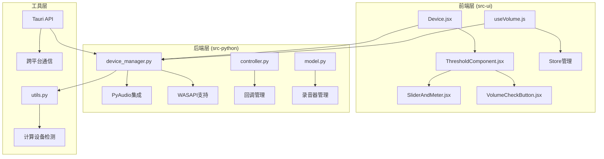
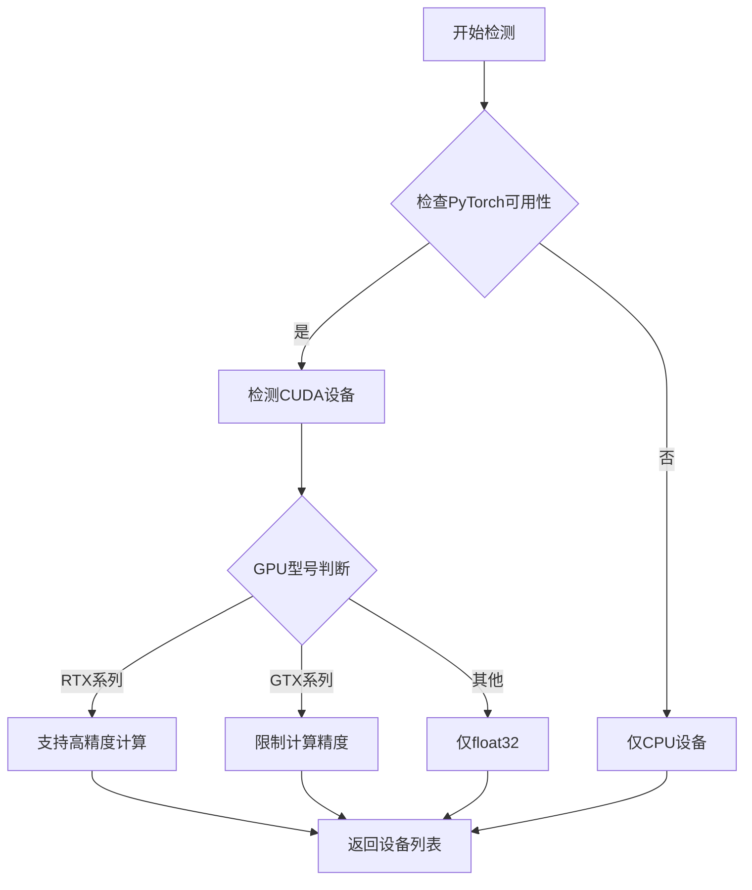
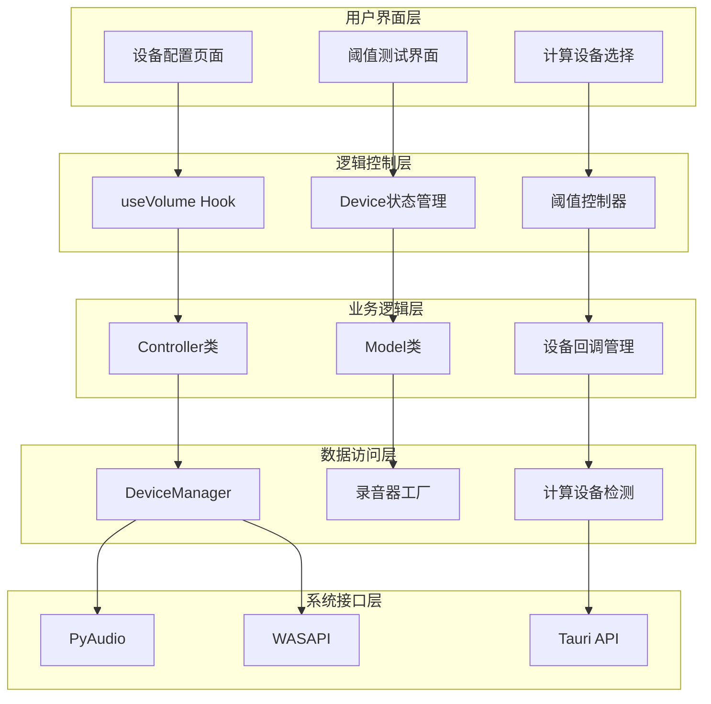
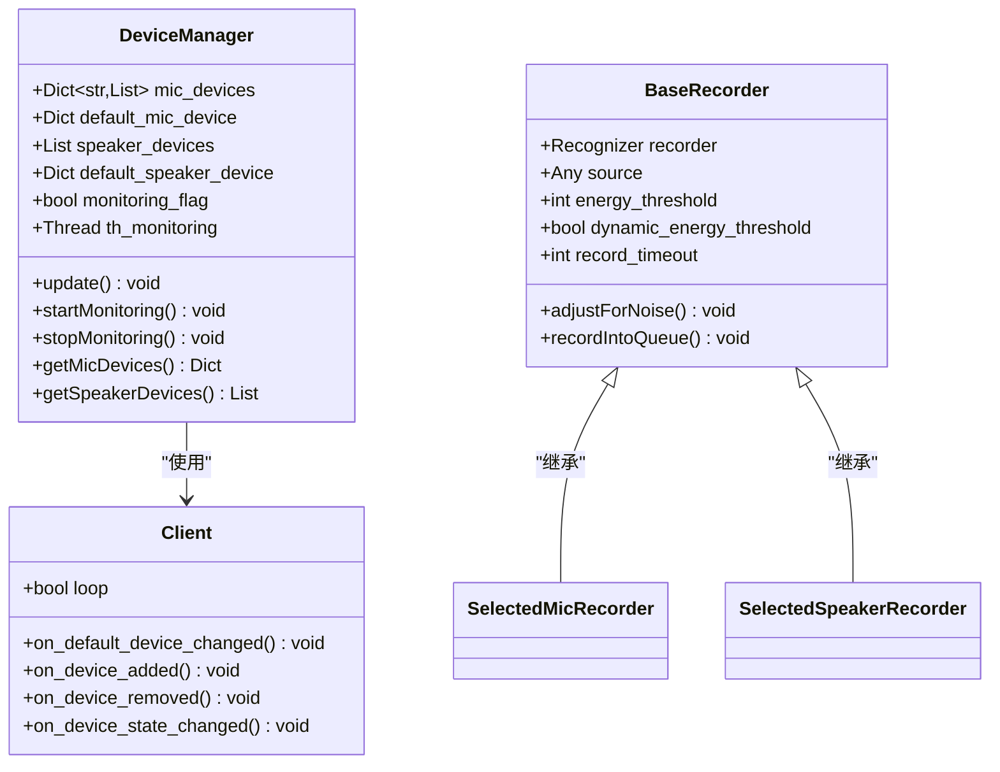
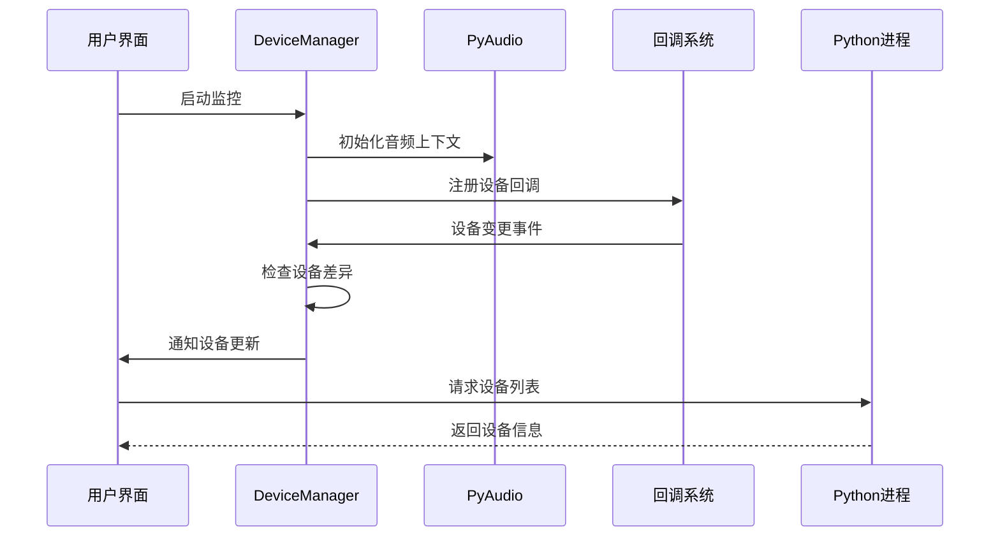
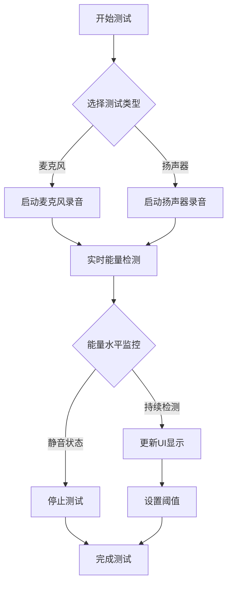
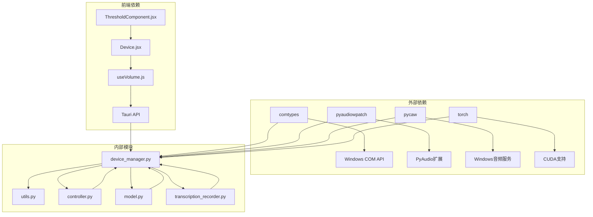

# 设备管理

<cite>
**本文档中引用的文件**
- [device_manager.py](file://src-python/device_manager.py)
- [transcription_recorder.py](file://src-python/models/transcription/transcription_recorder.py)
- [utils.py](file://src-python/utils.py)
- [controller.py](file://src-python/controller.py)
- [model.py](file://src-python/model.py)
- [useVolume.js](file://src-ui/logics/common/useVolume.js)
- [ComputeDevice.jsx](file://src-ui/views/app/config_page/setting_section/setting_box/_components/compute_device/ComputeDevice.jsx)
- [Device.jsx](file://src-ui/views/app/config_page/setting_section/setting_box/device/Device.jsx)
- [ThresholdComponent.jsx](file://src-ui/views/app/config_page/setting_section/setting_box/_components/threshold_component/ThresholdComponent.jsx)
- [SliderAndMeter.jsx](file://src-ui/views/app/config_page/setting_section/setting_box/_components/threshold_component/slider_and_meter/SliderAndMeter.jsx)
- [lib.rs](file://src-tauri/src/lib.rs)
- [vite.config.js](file://vite.config.js)
</cite>

## 目录
1. [简介](#简介)
2. [项目结构](#项目结构)
3. [核心组件](#核心组件)
4. [架构概览](#架构概览)
5. [详细组件分析](#详细组件分析)
6. [依赖关系分析](#依赖关系分析)
7. [性能考虑](#性能考虑)
8. [故障排除指南](#故障排除指南)
9. [结论](#结论)

## 简介

VRCT项目的设备管理系统是一个复杂而精密的音频设备管理框架，负责处理麦克风、扬声器等音频输入输出设备的枚举、选择、监控和测试。该系统采用前后端分离的架构，通过Tauri API实现前端界面与Python后端的通信，同时集成了多种计算后端的设备检测功能。

系统的核心功能包括：
- 音频设备的自动枚举和分类
- 实时设备变更监控
- 麦克风和扬声器的阈值测试
- 计算设备（CPU、CUDA、DirectML）的可用性检测
- 热重载机制确保设备状态的实时更新

## 项目结构

VRCT设备管理系统的文件组织遵循清晰的分层架构：

**图表来源**
- [Device.jsx](file://src-ui/views/app/config_page/setting_section/setting_box/device/Device.jsx#L1-L150)
- [device_manager.py](file://src-python/device_manager.py#L1-L100)
- [controller.py](file://src-python/controller.py#L1-L100)

**章节来源**
- [device_manager.py](file://src-python/device_manager.py#L1-L529)
- [Device.jsx](file://src-ui/views/app/config_page/setting_section/setting_box/device/Device.jsx#L1-L200)

## 核心组件

### DeviceManager类

DeviceManager是整个设备管理系统的核心，采用单例模式设计，负责音频设备的发现、管理和监控。

主要特性：
- **延迟初始化**: 避免导入时的资源占用
- **多主机API支持**: 支持WASAPI、DirectSound等不同音频API
- **实时监控**: 通过COM事件或轮询机制检测设备变更
- **错误恢复**: 完善的异常处理和降级机制

### 录音器系统

系统提供了多种录音器类型，适应不同的使用场景：

- **SelectedMicRecorder**: 传统麦克风录音
- **SelectedSpeakerRecorder**: 扬声器回环录音  
- **SelectedMicEnergyRecorder**: 能量检测专用
- **SelectedMicEnergyAndAudioRecorder**: 能量和音频同步录制

### 计算设备检测

通过utils.py中的函数实现多平台计算设备检测：

**图表来源**
- [utils.py](file://src-python/utils.py#L92-L171)

**章节来源**
- [device_manager.py](file://src-python/device_manager.py#L57-L120)
- [transcription_recorder.py](file://src-python/models/transcription/transcription_recorder.py#L38-L264)
- [utils.py](file://src-python/utils.py#L92-L171)

## 架构概览

VRCT设备管理系统采用分层架构，确保各组件间的松耦合和高内聚：

**图表来源**
- [controller.py](file://src-python/controller.py#L1-L100)
- [Device.jsx](file://src-ui/views/app/config_page/setting_section/setting_box/device/Device.jsx#L1-L50)
- [useVolume.js](file://src-ui/logics/common/useVolume.js#L1-L62)

## 详细组件分析

### 设备枚举与分类

DeviceManager实现了复杂的设备枚举逻辑，能够区分不同类型的音频设备：

**图表来源**
- [device_manager.py](file://src-python/device_manager.py#L26-L529)
- [transcription_recorder.py](file://src-python/models/transcription/transcription_recorder.py#L14-L264)

### 实时监控机制

系统实现了双重监控策略：

1. **COM事件监控**（Windows专用）：利用pycaw库监听设备变更事件
2. **轮询监控**：在不支持COM的平台上定期检查设备状态

**图表来源**
- [device_manager.py](file://src-python/device_manager.py#L266-L306)
- [controller.py](file://src-python/controller.py#L1117-L1120)

### 阈值测试系统

阈值测试功能允许用户验证麦克风和扬声器的灵敏度：

**图表来源**
- [useVolume.js](file://src-ui/logics/common/useVolume.js#L25-L62)
- [ThresholdComponent.jsx](file://src-ui/views/app/config_page/setting_section/setting_box/_components/threshold_component/ThresholdComponent.jsx#L36-L135)

**章节来源**
- [device_manager.py](file://src-python/device_manager.py#L140-L306)
- [useVolume.js](file://src-ui/logics/common/useVolume.js#L1-L62)
- [ThresholdComponent.jsx](file://src-ui/views/app/config_page/setting_section/setting_box/_components/threshold_component/ThresholdComponent.jsx#L1-L135)

### 计算设备检测

系统能够智能检测和选择最适合的计算设备：

| 设备类型 | 检测方法 | 支持精度 | 性能特点 |
|---------|---------|---------|---------|
| CPU | torch.cuda.is_available() | float32 | 兼容性最佳 |
| CUDA | GPU型号识别 | float16/int8 | 高性能推理 |
| GTX系列 | 型号字符串匹配 | float32 | 功耗优化 |
| RTX系列 | 型号字符串匹配 | float16/int8 | AI加速 |

**章节来源**
- [utils.py](file://src-python/utils.py#L92-L171)
- [ComputeDevice.jsx](file://src-ui/views/app/config_page/setting_section/setting_box/_components/compute_device/ComputeDevice.jsx#L1-L27)

## 依赖关系分析

设备管理系统的依赖关系呈现清晰的层次结构：

**图表来源**
- [device_manager.py](file://src-python/device_manager.py#L1-L25)
- [controller.py](file://src-python/controller.py#L1-L10)
- [useVolume.js](file://src-ui/logics/common/useVolume.js#L1-L10)

**章节来源**
- [device_manager.py](file://src-python/device_manager.py#L1-L25)
- [utils.py](file://src-python/utils.py#L1-L20)

## 性能考虑

### 内存管理

系统采用了多种内存优化策略：
- **延迟加载**: 设备管理器在首次需要时才初始化
- **对象池**: 复用录音器实例减少GC压力
- **弱引用**: 避免循环引用导致的内存泄漏

### 并发处理

设备监控采用异步并发模型：
- **独立线程**: 监控线程与主线程分离
- **事件驱动**: 基于回调的通知机制
- **资源锁**: 确保多线程环境下的数据一致性

### 网络通信优化

Tauri API通信经过精心优化：
- **消息压缩**: 减少网络传输开销
- **批量操作**: 合并多个小请求
- **连接复用**: 维护长连接减少握手开销

## 故障排除指南

### 常见问题及解决方案

#### 设备无法检测
**症状**: 设备列表为空或显示"NoDevice"
**原因**: PyAudio库缺失或权限不足
**解决**: 
1. 检查PyAudio安装状态
2. 以管理员权限运行应用
3. 验证音频驱动程序完整性

#### 阈值测试失败
**症状**: 测试过程中无声音响应
**原因**: 设备权限被拒绝或音频冲突
**解决**:
1. 关闭其他音频应用程序
2. 检查设备权限设置
3. 重启音频服务

#### 计算设备检测异常
**症状**: CUDA设备未被识别
**原因**: 显卡驱动过旧或CUDA版本不兼容
**解决**:
1. 更新显卡驱动程序
2. 安装对应CUDA版本
3. 检查PyTorch安装状态

**章节来源**
- [device_manager.py](file://src-python/device_manager.py#L140-L238)
- [utils.py](file://src-python/utils.py#L92-L171)

## 结论

VRCT的设备管理系统展现了现代软件工程的最佳实践，通过精心设计的架构实现了音频设备管理的完整解决方案。系统不仅具备强大的功能特性，还在性能优化、错误处理和用户体验方面达到了很高的水准。

关键技术亮点：
- **模块化设计**: 清晰的职责分离和接口定义
- **跨平台兼容**: 统一的API抽象不同操作系统差异
- **实时响应**: 高效的监控机制确保设备状态的及时更新
- **智能检测**: 自动化的设备选择和配置优化

该系统为VRChat等实时通讯应用提供了坚实的音频基础设施，其设计理念和实现方式值得在类似项目中借鉴和应用。