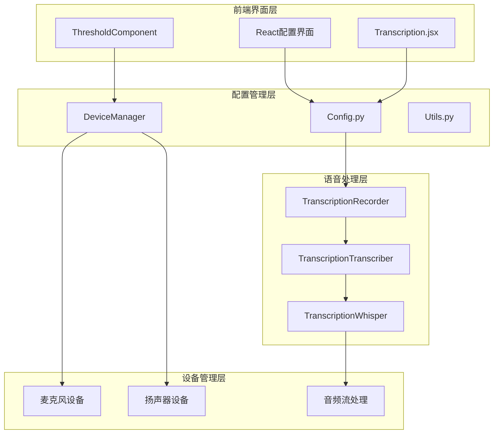
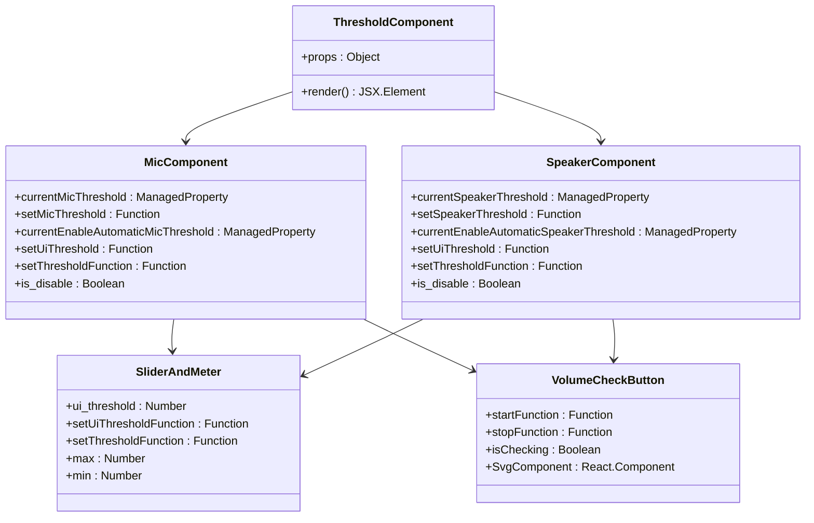
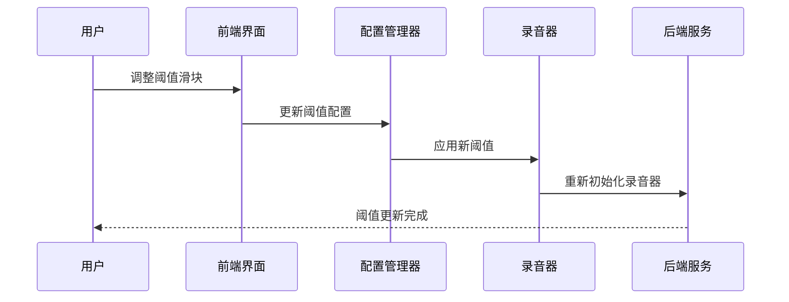
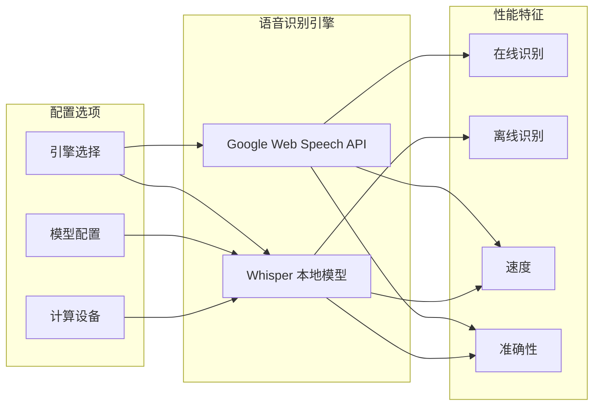
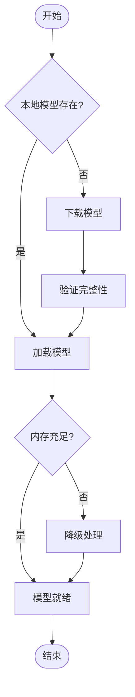
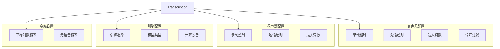
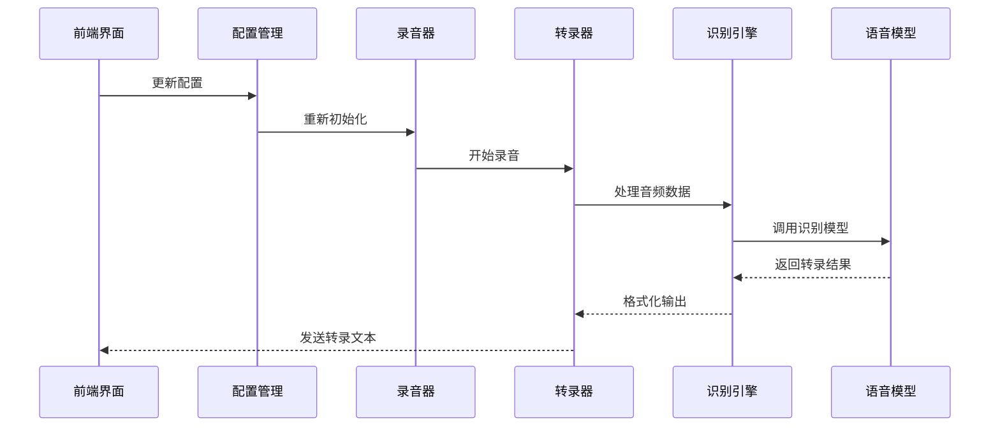
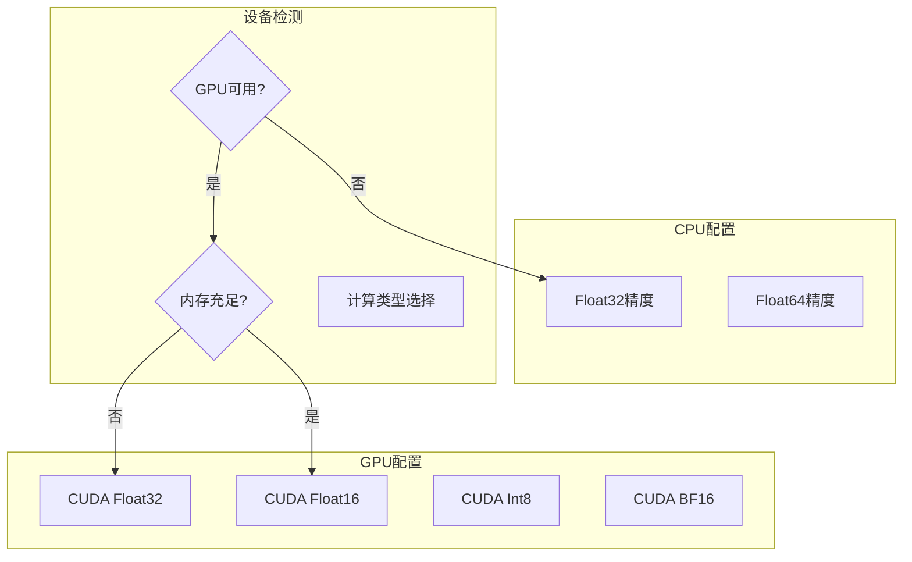

# 语音转录设置

<cite>
**本文档中引用的文件**
- [ThresholdComponent.jsx](file://src-ui/views/app/config_page/setting_section/setting_box/_components/threshold_component/ThresholdComponent.jsx)
- [SliderAndMeter.jsx](file://src-ui/views/app/config_page/setting_section/setting_box/_components/threshold_component/slider_and_meter/SliderAndMeter.jsx)
- [ThresholdEntry.jsx](file://src-ui/views/app/config_page/setting_section/setting_box/_components/threshold_component/threshold_entry/ThresholdEntry.jsx)
- [VolumeCheckButton.jsx](file://src-ui/views/app/config_page/setting_section/setting_box/_components/threshold_component/volume_check_button/VolumeCheckButton.jsx)
- [transcription_recorder.py](file://src-python/models/transcription/transcription_recorder.py)
- [transcription_whisper.py](file://src-python/models/transcription/transcription_whisper.py)
- [transcription_transcriber.py](file://src-python/models/transcription/transcription_transcriber.py)
- [Transcription.jsx](file://src-ui/views/app/config_page/setting_section/setting_box/transcription/Transcription.jsx)
- [config.py](file://src-python/config.py)
- [device_manager.py](file://src-python/device_manager.py)
- [utils.py](file://src-python/utils.py)
</cite>

## 目录
1. [简介](#简介)
2. [系统架构概览](#系统架构概览)
3. [语音检测阈值配置](#语音检测阈值配置)
4. [语音识别引擎配置](#语音识别引擎配置)
5. [模型配置与管理](#模型配置与管理)
6. [前端配置界面](#前端配置界面)
7. [后端处理流程](#后端处理流程)
8. [性能优化与权衡](#性能优化与权衡)
9. [故障排除指南](#故障排除指南)
10. [总结](#总结)

## 简介

VRCT语音转录系统是一个基于React和Python的跨平台应用程序，提供了强大的语音转录功能。该系统支持多种语音识别引擎，包括Google Web Speech API和Whisper本地模型，具备灵活的配置选项和实时反馈机制。

核心特性包括：
- 动态语音检测阈值调节
- 多种语音识别引擎选择
- 可配置的Whisper模型下载和管理
- 实时音量监控和自动阈值调整
- 高度可定制的转录参数

## 系统架构概览

语音转录系统采用前后端分离架构，通过WebSocket进行通信：

**图表来源**
- [ThresholdComponent.jsx](file://src-ui/views/app/config_page/setting_section/setting_box/_components/threshold_component/ThresholdComponent.jsx#L1-L135)
- [transcription_recorder.py](file://src-python/models/transcription/transcription_recorder.py#L1-L264)
- [config.py](file://src-python/config.py#L1-L800)

## 语音检测阈值配置

### ThresholdComponent核心功能

ThresholdComponent是语音转录系统中负责动态灵敏度调节的核心组件，它实现了智能的语音检测阈值管理：

**图表来源**
- [ThresholdComponent.jsx](file://src-ui/views/app/config_page/setting_section/setting_box/_components/threshold_component/ThresholdComponent.jsx#L13-L135)
- [SliderAndMeter.jsx](file://src-ui/views/app/config_page/setting_section/setting_box/_components/threshold_component/slider_and_meter/SliderAndMeter.jsx#L1-L88)

### 动态阈值调节机制

系统支持两种阈值调节模式：

1. **手动模式**：用户直接设置固定阈值
2. **自动模式**：系统根据环境噪声自动调整

#### 手动阈值设置流程

**图表来源**
- [ThresholdComponent.jsx](file://src-ui/views/app/config_page/setting_section/setting_box/_components/threshold_component/ThresholdComponent.jsx#L46-L51)
- [transcription_recorder.py](file://src-python/models/transcription/transcription_recorder.py#L14-L36)

### 音量监控与实时反馈

系统提供实时音量监控功能，通过VolumeCheckButton组件实现：

- **音量指示器**：显示当前输入音量水平
- **阈值对比**：实时显示音量与阈值的关系
- **状态反馈**：提供检查状态的视觉反馈

**章节来源**
- [ThresholdComponent.jsx](file://src-ui/views/app/config_page/setting_section/setting_box/_components/threshold_component/ThresholdComponent.jsx#L1-L135)
- [SliderAndMeter.jsx](file://src-ui/views/app/config_page/setting_section/setting_box/_components/threshold_component/slider_and_meter/SliderAndMeter.jsx#L1-L88)
- [VolumeCheckButton.jsx](file://src-ui/views/app/config_page/setting_section/setting_box/_components/threshold_component/volume_check_button/VolumeCheckButton.jsx#L1-L33)

## 语音识别引擎配置

### 引擎选择与切换

系统支持两种主要的语音识别引擎：

**图表来源**
- [Transcription.jsx](file://src-ui/views/app/config_page/setting_section/setting_box/transcription/Transcription.jsx#L215-L230)
- [transcription_transcriber.py](file://src-python/models/transcription/transcription_transcriber.py#L31-L80)

### Whisper模型配置

Whisper模型提供了丰富的配置选项：

| 配置项 | 默认值 | 描述 | 性能影响 |
|--------|--------|------|----------|
| 模型大小 | base | tiny/base/small/medium/large-v1/v2/v3 | 大小决定准确性和性能 |
| 计算类型 | auto | float32/int8/bfloat16/float16 | 影响推理速度和内存使用 |
| 设备类型 | cpu | cpu/cuda | 硬件加速支持 |
| beam_size | 5 | 解码搜索宽度 | 准确性vs速度平衡 |
| temperature | 0.0 | 采样温度 | 结果多样性控制 |

**章节来源**
- [Transcription.jsx](file://src-ui/views/app/config_page/setting_section/setting_box/transcription/Transcription.jsx#L233-L273)
- [transcription_whisper.py](file://src-python/models/transcription/transcription_whisper.py#L112-L161)

## 模型配置与管理

### Whisper模型下载与管理

系统提供了完整的Whisper模型生命周期管理：

**图表来源**
- [transcription_whisper.py](file://src-python/models/transcription/transcription_whisper.py#L67-L111)

### 模型性能权衡

不同模型配置对系统性能的影响：

| 模型配置 | 推理速度 | 内存占用 | 准确性 | 适用场景 |
|----------|----------|----------|--------|----------|
| tiny | 最快 | 最低 | 中等 | 资源受限环境 |
| base | 快速 | 低 | 高 | 平衡需求 |
| small | 中等 | 中等 | 很高 | 一般用途 |
| medium | 较慢 | 高 | 极高 | 高质量要求 |
| large-v3 | 慢 | 最高 | 最高 | 专业应用 |

**章节来源**
- [transcription_whisper.py](file://src-python/models/transcription/transcription_whisper.py#L23-L33)
- [Transcription.jsx](file://src-ui/views/app/config_page/setting_section/setting_box/transcription/Transcription.jsx#L233-L273)

## 前端配置界面

### Transcription.jsx组件结构

Transcription组件提供了完整的语音转录配置界面：

**图表来源**
- [Transcription.jsx](file://src-ui/views/app/config_page/setting_section/setting_box/transcription/Transcription.jsx#L29-L523)

### 用户输入验证

前端界面实现了多层次的输入验证：

1. **范围验证**：确保数值在有效范围内
2. **类型验证**：防止非法数据类型
3. **格式验证**：验证字符串格式
4. **依赖验证**：检查配置间的相互依赖关系

**章节来源**
- [Transcription.jsx](file://src-ui/views/app/config_page/setting_section/setting_box/transcription/Transcription.jsx#L1-L523)

## 后端处理流程

### 音频处理管道

语音转录的后端处理遵循以下流程：

**图表来源**
- [transcription_recorder.py](file://src-python/models/transcription/transcription_recorder.py#L14-L36)
- [transcription_transcriber.py](file://src-python/models/transcription/transcription_transcriber.py#L80-L160)

### 配置变更响应机制

当用户修改配置时，系统会触发相应的后端重载：

1. **阈值变更**：重新初始化录音器实例
2. **引擎切换**：卸载旧引擎，加载新引擎
3. **模型更新**：下载新模型并重新加载
4. **设备变更**：重新扫描和初始化音频设备

**章节来源**
- [transcription_recorder.py](file://src-python/models/transcription/transcription_recorder.py#L1-L264)
- [transcription_transcriber.py](file://src-python/models/transcription/transcription_transcriber.py#L1-L220)

## 性能优化与权衡

### 计算设备优化

系统根据硬件能力自动选择最优的计算配置：

**图表来源**
- [utils.py](file://src-python/utils.py#L92-L171)
- [Transcription.jsx](file://src-ui/views/app/config_page/setting_section/setting_box/transcription/Transcription.jsx#L277-L396)

### 性能调优建议

针对不同使用场景的性能优化建议：

1. **实时转录**：使用较小模型（base/tiny），启用GPU加速
2. **批量处理**：使用较大模型（medium/large），优化批处理大小
3. **资源受限**：禁用GPU，使用CPU模式，降低精度
4. **高质量要求**：使用大模型，启用多语言支持

**章节来源**
- [utils.py](file://src-python/utils.py#L134-L171)
- [transcription_whisper.py](file://src-python/models/transcription/transcription_whisper.py#L112-L161)

## 故障排除指南

### 常见问题与解决方案

| 问题类型 | 症状 | 可能原因 | 解决方案 |
|----------|------|----------|----------|
| 音频输入问题 | 无法检测到声音 | 麦克风权限、设备冲突 | 检查设备设置，重启应用 |
| 转录不准确 | 识别错误率高 | 阈值设置不当、模型问题 | 调整阈值，更换模型 |
| 性能问题 | 转录延迟高 | 模型过大、硬件不足 | 降低模型大小，启用GPU |
| 下载失败 | 模型下载中断 | 网络连接问题 | 检查网络，重试下载 |

### 日志记录与调试

系统提供了详细的日志记录功能，帮助诊断问题：

- **配置变更日志**：记录所有配置修改
- **设备状态日志**：跟踪设备连接状态
- **性能指标日志**：监控处理时间和资源使用
- **错误异常日志**：记录运行时错误

**章节来源**
- [config.py](file://src-python/config.py#L1-L800)
- [device_manager.py](file://src-python/device_manager.py#L1-L529)

## 总结

VRCT语音转录系统提供了一个功能完整、高度可配置的语音识别解决方案。通过ThresholdComponent的智能阈值调节、灵活的引擎选择、完善的模型管理和直观的前端界面，用户可以根据具体需求优化系统性能。

关键优势包括：
- **灵活性**：支持多种配置选项和自定义设置
- **可靠性**：完善的错误处理和恢复机制
- **性能**：针对不同硬件的优化配置
- **易用性**：直观的配置界面和实时反馈

系统的设计充分考虑了实际应用场景的需求，在保证高质量转录的同时，也兼顾了性能和用户体验的平衡。通过持续的配置优化和模型更新，可以满足从个人使用到专业应用的各种需求。