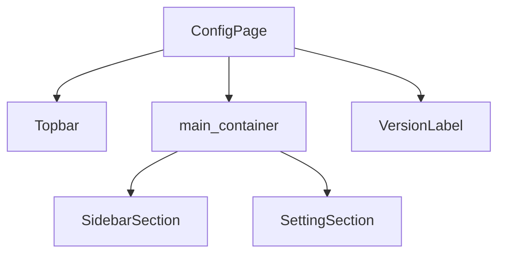
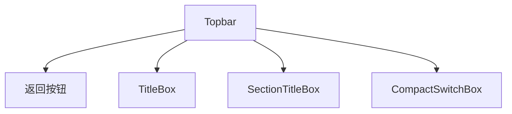
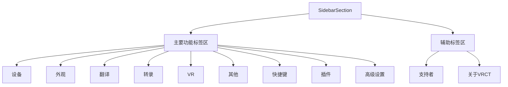
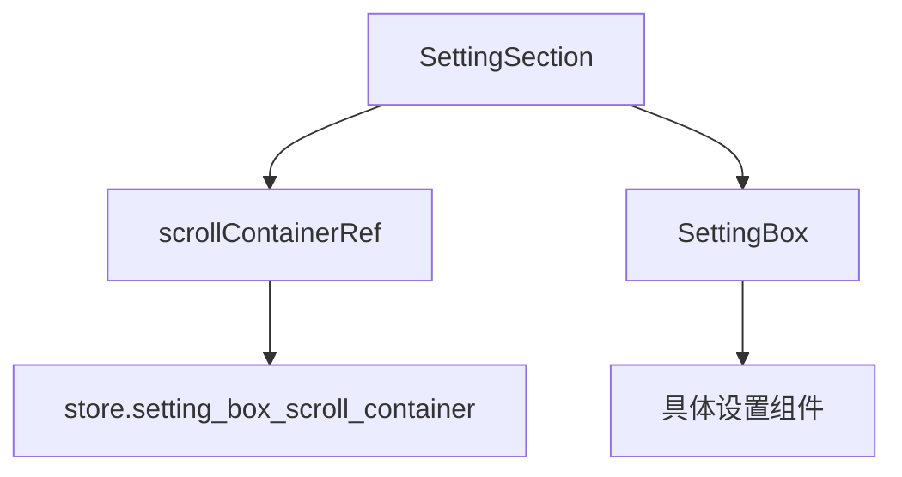
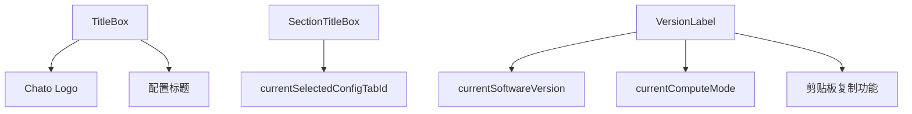
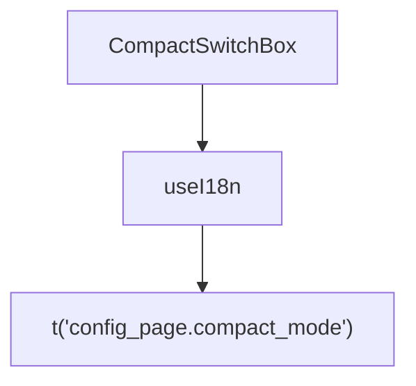
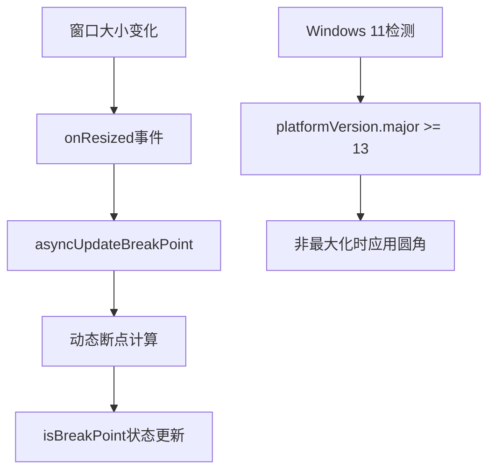
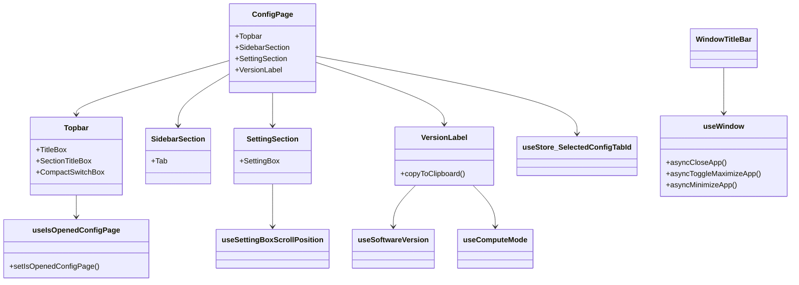

# 配置页面布局结构

<cite>
**本文档中引用的文件**  
- [ConfigPage.jsx](file://src-ui/views/app/config_page/ConfigPage.jsx)
- [ConfigPage.module.scss](file://src-ui/views/app/config_page/ConfigPage.module.scss)
- [Topbar.jsx](file://src-ui/views/app/config_page/topbar/Topbar.jsx)
- [Topbar.module.scss](file://src-ui/views/app/config_page/topbar/Topbar.module.scss)
- [SidebarSection.jsx](file://src-ui/views/app/config_page/sidebar_section/SidebarSection.jsx)
- [SidebarSection.module.scss](file://src-ui/views/app/config_page/sidebar_section/SidebarSection.module.scss)
- [SettingSection.jsx](file://src-ui/views/app/config_page/setting_section/SettingSection.jsx)
- [SettingSection.module.scss](file://src-ui/views/app/config_page/setting_section/SettingSection.module.scss)
- [TitleBox.jsx](file://src-ui/views/app/config_page/topbar/title_box/TitleBox.jsx)
- [SectionTitleBox.jsx](file://src-ui/views/app/config_page/topbar/section_title_box/SectionTitleBox.jsx)
- [CompactSwitchBox.jsx](file://src-ui/views/app/config_page/topbar/compact_switch_box/CompactSwitchBox.jsx)
- [VersionLabel.jsx](file://src-ui/views/app/config_page/version_label/VersionLabel.jsx)
- [useIsOpenedConfigPage.js](file://src-ui/logics/common/useIsOpenedConfigPage.js)
- [useWindow.js](file://src-ui/logics/common/useWindow.js)
- [CornerRadiusController.jsx](file://src-ui/views/app/_app_controllers/CornerRadiusController.jsx)
- [WindowTitleBar.jsx](file://src-ui/views/app/others/window_title_bar/WindowTitleBar.jsx)
</cite>

## 目录
1. [简介](#简介)
2. [整体布局结构](#整体布局结构)
3. [顶部导航栏（Topbar）](#顶部导航栏topbar)
4. [侧边栏菜单（SidebarSection）](#侧边栏菜单sidebarsection)
5. [主内容区域（SettingSection）](#主内容区域settingsection)
6. [页面标题与版本标签](#页面标题与版本标签)
7. [紧凑模式切换按钮](#紧凑模式切换按钮)
8. [响应式布局机制](#响应式布局机制)
9. [Tauri原生窗口控制集成](#tauri原生窗口控制集成)
10. [组件树与样式管理](#组件树与样式管理)

## 简介
本文件详细说明VRCT应用中配置页面的整体布局结构。该页面采用现代化的React组件化设计，结合Tauri框架实现跨平台桌面应用功能。页面由顶部导航栏、侧边栏菜单和主内容区域三大部分构成，支持动态语言切换、版本信息展示和紧凑模式切换等交互特性。通过SCSS模块化样式管理和Zustand状态管理，实现了清晰的组件嵌套关系和高效的UI更新机制。

## 整体布局结构

配置页面采用绝对定位的全屏布局，通过Flexbox实现垂直方向的主轴排列。页面根容器包含三个主要子组件：顶部导航栏（Topbar）、主内容容器（main_container）和版本标签（VersionLabel）。主内容容器内部采用水平Flexbox布局，包含侧边栏（SidebarSection）和设置区域（SettingSection）两个并列组件。



**图示来源**
- [ConfigPage.jsx](file://src-ui/views/app/config_page/ConfigPage.jsx#L8-L21)

**本节来源**
- [ConfigPage.jsx](file://src-ui/views/app/config_page/ConfigPage.jsx#L8-L21)
- [ConfigPage.module.scss](file://src-ui/views/app/config_page/ConfigPage.module.scss#L1-L26)

## 顶部导航栏（Topbar）

顶部导航栏组件（Topbar）采用绝对定位策略，通过CSS类名控制其显示状态。当配置页面打开时，导航栏位于视口顶部；当返回主页面时，通过CSS过渡动画将其移出视口。导航栏包含返回按钮、页面标题、当前设置类别标题和紧凑模式切换按钮等子组件。



**图示来源**
- [Topbar.jsx](file://src-ui/views/app/config_page/topbar/Topbar.jsx#L12-L38)
- [Topbar.module.scss](file://src-ui/views/app/config_page/topbar/Topbar.module.scss#L1-L82)

**本节来源**
- [Topbar.jsx](file://src-ui/views/app/config_page/topbar/Topbar.jsx#L12-L38)
- [Topbar.module.scss](file://src-ui/views/app/config_page/topbar/Topbar.module.scss#L1-L82)

## 侧边栏菜单（SidebarSection）

侧边栏菜单采用固定宽度设计，通过CSS变量`--config_page_sidebar_width`控制其尺寸。菜单内容分为两个区域：主要功能标签和分离的辅助标签。每个标签项（Tab）通过Zustand状态管理器跟踪当前选中状态，并在选中时显示左侧指示条。



**图示来源**
- [SidebarSection.jsx](file://src-ui/views/app/config_page/sidebar_section/SidebarSection.jsx#L3-L61)
- [SidebarSection.module.scss](file://src-ui/views/app/config_page/sidebar_section/SidebarSection.module.scss#L1-L79)

**本节来源**
- [SidebarSection.jsx](file://src-ui/views/app/config_page/sidebar_section/SidebarSection.jsx#L3-L61)
- [SidebarSection.module.scss](file://src-ui/views/app/config_page/sidebar_section/SidebarSection.module.scss#L1-L79)

## 主内容区域（SettingSection）

主内容区域采用滚动容器设计，确保在不同屏幕尺寸下都能完整显示设置选项。该区域通过`useRef`和`useLayoutEffect`将滚动容器引用存储到全局store中，便于其他组件访问。当用户切换侧边栏标签时，会自动重置滚动位置到顶部。



**图示来源**
- [SettingSection.jsx](file://src-ui/views/app/config_page/setting_section/SettingSection.jsx#L8-L28)
- [SettingSection.module.scss](file://src-ui/views/app/config_page/setting_section/SettingSection.module.scss#L1-L9)

**本节来源**
- [SettingSection.jsx](file://src-ui/views/app/config_page/setting_section/SettingSection.jsx#L8-L28)
- [SettingSection.module.scss](file://src-ui/views/app/config_page/setting_section/SettingSection.module.scss#L1-L9)

## 页面标题与版本标签

页面标题由`TitleBox`组件实现，包含应用Logo和"配置"文字标签。当前设置类别标题由`SectionTitleBox`组件实现，根据Zustand store中的`currentSelectedConfigTabId`动态显示对应的本地化标签。版本标签（VersionLabel）显示当前软件版本和计算模式（CPU/CUDA），并支持点击复制到剪贴板。



**本节来源**
- [TitleBox.jsx](file://src-ui/views/app/config_page/topbar/title_box/TitleBox.jsx#L6-L14)
- [SectionTitleBox.jsx](file://src-ui/views/app/config_page/topbar/section_title_box/SectionTitleBox.jsx#L5-L13)
- [VersionLabel.jsx](file://src-ui/views/app/config_page/version_label/VersionLabel.jsx#L10-L48)

## 紧凑模式切换按钮

紧凑模式切换按钮（CompactSwitchBox）提供用户切换界面紧凑模式的功能。该组件目前仅包含文本标签，实际的紧凑模式逻辑在主页面的`SidebarCompactModeButton`中实现。按钮通过`useI18n`钩子实现多语言支持，显示"紧凑模式"文本。



**本节来源**
- [CompactSwitchBox.jsx](file://src-ui/views/app/config_page/topbar/compact_switch_box/CompactSwitchBox.jsx#L5-L12)
- [SidebarCompactModeButton.jsx](file://src-ui/views/app/main_page/main_section/top_bar/sidebar_compact_mode_button/SidebarCompactModeButton.jsx#L7-L19)

## 响应式布局机制

配置页面通过多种机制实现响应式布局。`useWindow`逻辑组件监听窗口大小变化，当窗口宽度小于基于UI缩放比例计算的断点值（800 * 缩放比例）时，更新`isBreakPoint`状态。`CornerRadiusController`组件根据操作系统类型（Windows 11）和窗口最大化状态动态调整窗口圆角半径，实现与系统UI的一致性。



**本节来源**
- [useWindow.js](file://src-ui/logics/common/useWindow.js#L94-L138)
- [CornerRadiusController.jsx](file://src-ui/views/app/_app_controllers/CornerRadiusController.jsx#L1-L54)

## Tauri原生窗口控制集成

前端UI通过Tauri API与原生窗口系统深度集成。`WindowTitleBar`组件使用`data-tauri-drag-region`属性定义可拖拽区域，实现窗口拖动。窗口控制按钮（关闭、最大化、最小化）通过`useWindow`钩子调用Tauri的`appWindow` API实现原生窗口操作。应用启动时，`StartPythonController`启动后端Python进程，实现前后端协同工作。

```mermaid
graph TD
A[WindowTitleBar] --> B[data-tauri-drag-region]
A --> C[关闭按钮]
A --> D[最大化按钮]
A --> E[最小化按钮]
C --> F[appWindow.close()]
D --> G[appWindow.maximize/unmaximize()]
E --> H[appWindow.minimize()]
I[StartPythonController] --> J[启动Python后端]
```

**本节来源**
- [WindowTitleBar.jsx](file://src-ui/views/app/others/window_title_bar/WindowTitleBar.jsx#L9-L33)
- [useWindow.js](file://src-ui/logics/common/useWindow.js#L159-L169)

## 组件树与样式管理

配置页面采用清晰的组件树结构，所有样式均通过SCSS模块化管理，避免全局样式污染。组件间通过Zustand状态管理器进行通信，`store`对象集中管理应用状态。逻辑组件（位于`logics`目录）封装业务逻辑，视图组件（位于`views`目录）专注于UI渲染，实现关注点分离。



**图示来源**
- [ConfigPage.jsx](file://src-ui/views/app/config_page/ConfigPage.jsx#L8-L21)
- [Topbar.jsx](file://src-ui/views/app/config_page/topbar/Topbar.jsx#L12-L38)
- [SidebarSection.jsx](file://src-ui/views/app/config_page/sidebar_section/SidebarSection.jsx#L3-L61)
- [SettingSection.jsx](file://src-ui/views/app/config_page/setting_section/SettingSection.jsx#L8-L28)
- [VersionLabel.jsx](file://src-ui/views/app/config_page/version_label/VersionLabel.jsx#L10-L48)
- [useIsOpenedConfigPage.js](file://src-ui/logics/common/useIsOpenedConfigPage.js#L3-L15)
- [useWindow.js](file://src-ui/logics/common/useWindow.js#L8-L169)

**本节来源**
- [ConfigPage.jsx](file://src-ui/views/app/config_page/ConfigPage.jsx#L8-L21)
- [Topbar.jsx](file://src-ui/views/app/config_page/topbar/Topbar.jsx#L12-L38)
- [SidebarSection.jsx](file://src-ui/views/app/config_page/sidebar_section/SidebarSection.jsx#L3-L61)
- [SettingSection.jsx](file://src-ui/views/app/config_page/setting_section/SettingSection.jsx#L8-L28)
- [VersionLabel.jsx](file://src-ui/views/app/config_page/version_label/VersionLabel.jsx#L10-L48)
- [useIsOpenedConfigPage.js](file://src-ui/logics/common/useIsOpenedConfigPage.js#L3-L15)
- [useWindow.js](file://src-ui/logics/common/useWindow.js#L8-L169)