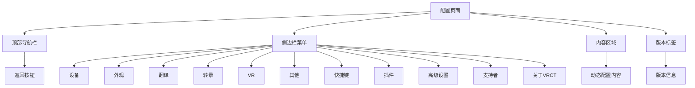
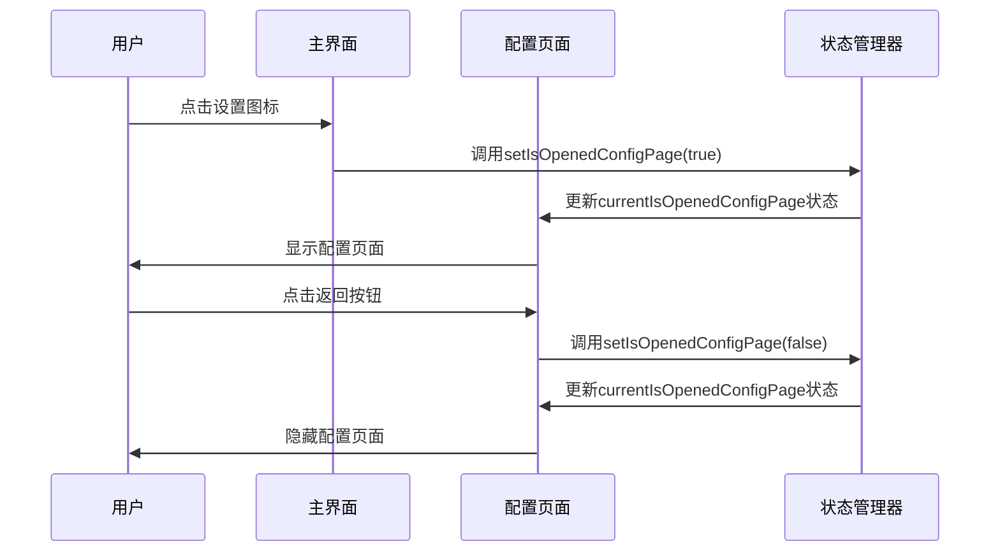
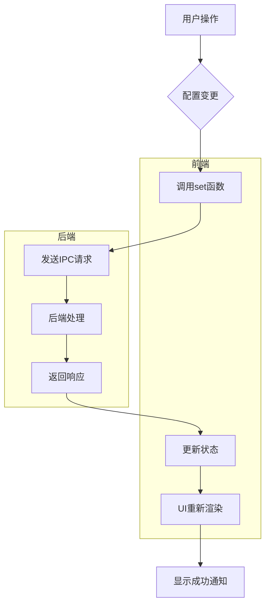
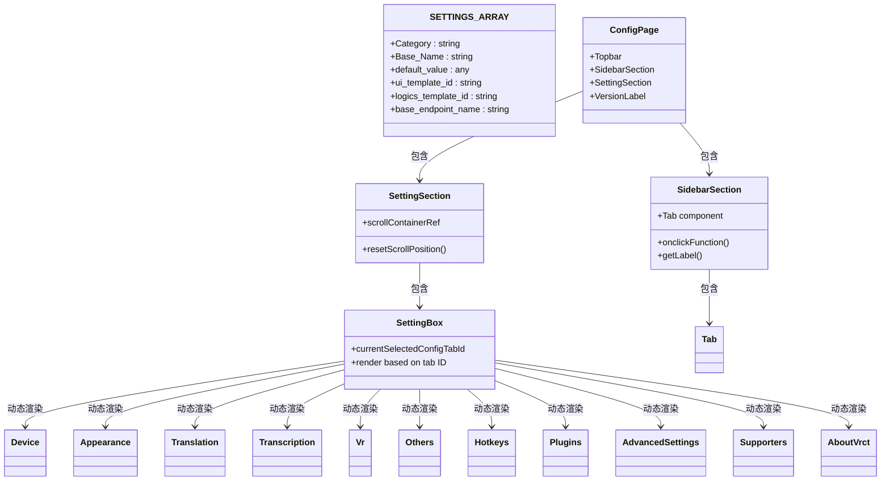
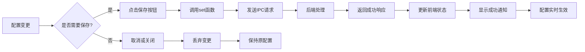

# 配置页面指南

<cite>
**本文档引用文件**  
- [ConfigPage.jsx](file://src-ui/views/app/config_page/ConfigPage.jsx)
- [SettingSection.jsx](file://src-ui/views/app/config_page/setting_section/SettingSection.jsx)
- [SettingBox.jsx](file://src-ui/views/app/config_page/setting_section/setting_box/SettingBox.jsx)
- [SidebarSection.jsx](file://src-ui/views/app/config_page/sidebar_section/SidebarSection.jsx)
- [Topbar.jsx](file://src-ui/views/app/config_page/topbar/Topbar.jsx)
- [store.js](file://src-ui/logics/store.js)
- [ui_config_setter.js](file://src-ui/logics/configs/config_page_setter/ui_config_setter.js)
- [useSettingsLogics.js](file://src-ui/logics/configs/config_page_setter/useSettingsLogics.js)
- [useIsOpenedConfigPage.js](file://src-ui/logics/common/useIsOpenedConfigPage.js)
- [VersionLabel.jsx](file://src-ui/views/app/config_page/version_label/VersionLabel.jsx)
</cite>

## 目录
1. [配置页面结构](#配置页面结构)
2. [导航与交互设计](#导航与交互设计)
3. [状态管理与数据同步](#状态管理与数据同步)
4. [配置项分组与动态渲染](#配置项分组与动态渲染)
5. [配置操作与实时生效](#配置操作与实时生效)

## 配置页面结构

VRCT应用的配置页面采用经典的三栏式布局结构，由顶部导航栏、侧边栏菜单和内容区域三部分组成。这种布局设计提供了清晰的导航路径和直观的操作体验。

**图示来源**  
- [ConfigPage.jsx](file://src-ui/views/app/config_page/ConfigPage.jsx#L8-L21)
- [SidebarSection.jsx](file://src-ui/views/app/config_page/sidebar_section/SidebarSection.jsx#L8-L21)

## 导航与交互设计

配置页面的导航系统由三个主要组件构成：顶部导航栏、侧边栏菜单和内容区域。用户通过点击侧边栏中的不同标签来切换配置类别，内容区域会相应地动态更新显示对应的配置项。

顶部导航栏包含一个返回按钮，允许用户关闭配置页面并返回主界面。当用户点击主界面上的设置图标时，配置页面会从屏幕顶部滑入，主界面则向上移动隐藏。

**交互流程来源**  
- [OpenSettings.jsx](file://src-ui/views/app/main_page/sidebar_section/open_settings/OpenSettings.jsx#L8-L10)
- [Topbar.jsx](file://src-ui/views/app/config_page/topbar/Topbar.jsx#L15-L17)
- [useIsOpenedConfigPage.js](file://src-ui/logics/common/useIsOpenedConfigPage.js#L6-L8)

## 状态管理与数据同步

配置页面采用Jotai状态管理库来管理应用状态，通过原子化状态存储实现高效的UI更新。所有配置相关的状态都存储在全局store中，并通过自定义Hook进行访问和更新。

配置系统通过Tauri IPC（进程间通信）与后端Python服务进行数据同步。当用户修改配置时，前端会通过`asyncStdoutToPython`函数发送HTTP请求到后端API端点，后端处理完成后返回响应，前端状态随之更新。

**状态管理来源**  
- [store.js](file://src-ui/logics/store.js#L1-L248)
- [useSettingsLogics.js](file://src-ui/logics/configs/config_page_setter/useSettingsLogics.js#L20-L118)
- [ui_config_setter.js](file://src-ui/logics/configs/config_page_setter/ui_config_setter.js#L695-L697)

## 配置项分组与动态渲染

配置项按照功能分为多个类别，包括设备、外观、翻译、转录、VR、其他、快捷键、插件和高级设置等。每个类别的配置项在`SETTINGS_ARRAY`中定义，包含配置名称、默认值、UI模板类型和后端端点等元数据。

内容区域采用动态渲染机制，根据当前选中的标签ID决定显示哪个配置组件。`SettingBox`组件使用switch语句根据`currentSelectedConfigTabId`的值来渲染相应的配置界面。

**分组与渲染来源**  
- [SettingBox.jsx](file://src-ui/views/app/config_page/setting_section/setting_box/SettingBox.jsx#L19-L45)
- [ui_config_setter.js](file://src-ui/logics/configs/config_page_setter/ui_config_setter.js#L15-L691)
- [SettingSection.jsx](file://src-ui/views/app/config_page/setting_section/SettingSection.jsx#L9-L19)

## 配置操作与实时生效

配置页面提供了完整的配置操作功能，包括保存、重置和页面切换。当用户修改配置并触发保存操作时，系统会通过Tauri IPC向后端发送更新请求，配置变更会立即生效。

每个配置项都有对应的获取(get)、设置(set)和删除(delete)操作函数，这些函数由`useSettingsLogics`根据`SETTINGS_ARRAY`自动生成。当配置成功更新后，系统会显示一个成功通知，告知用户配置已保存。

页面切换时，系统会自动重置内容区域的滚动位置，确保用户每次进入配置页面时都能看到顶部内容。版本标签组件还提供了点击复制版本信息到剪贴板的功能，方便用户分享或报告问题。

**操作与生效来源**  
- [useSettingsLogics.js](file://src-ui/logics/configs/config_page_setter/useSettingsLogics.js#L75-L87)
- [useNotificationStatus.js](file://src-ui/logics/common/useNotificationStatus.js#L38-L47)
- [SettingSection.jsx](file://src-ui/views/app/config_page/setting_section/SettingSection.jsx#L17-L19)
- [VersionLabel.jsx](file://src-ui/views/app/config_page/version_label/VersionLabel.jsx#L25-L34)