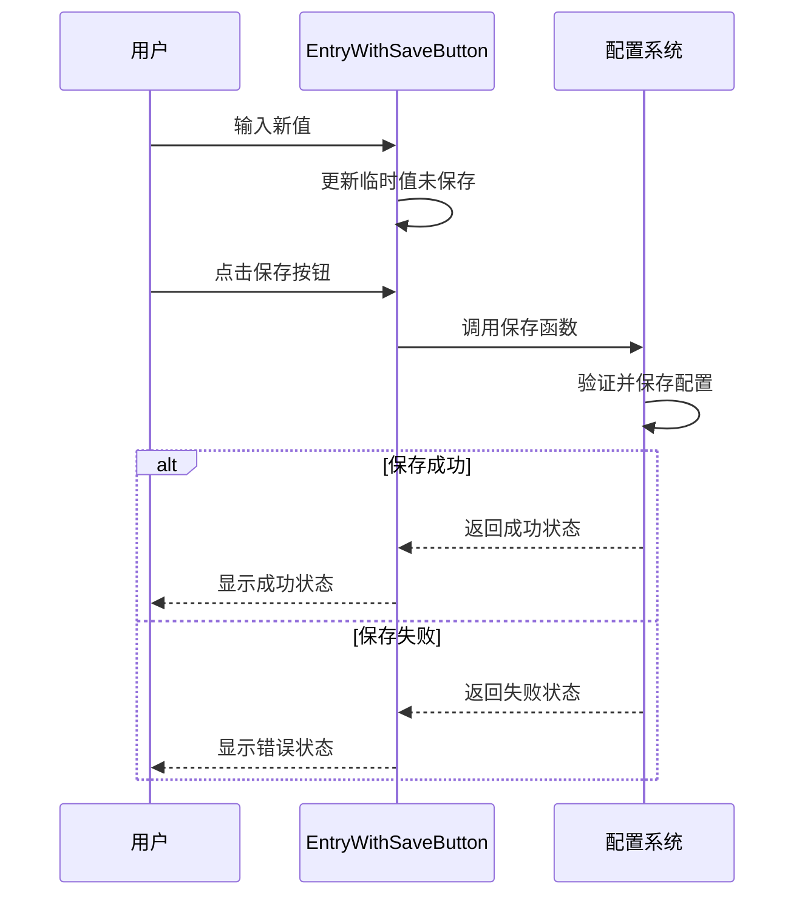
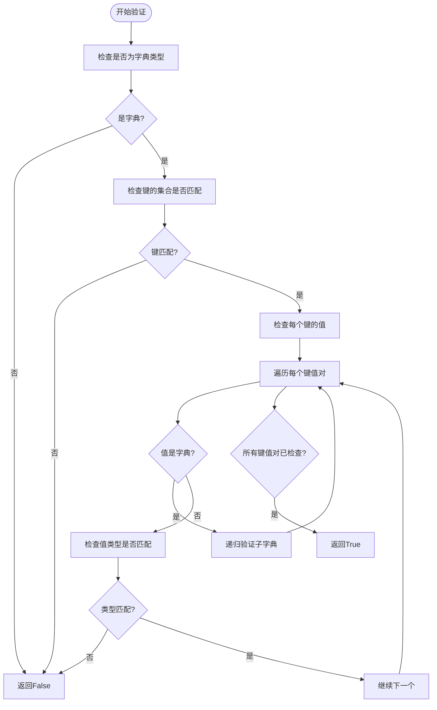
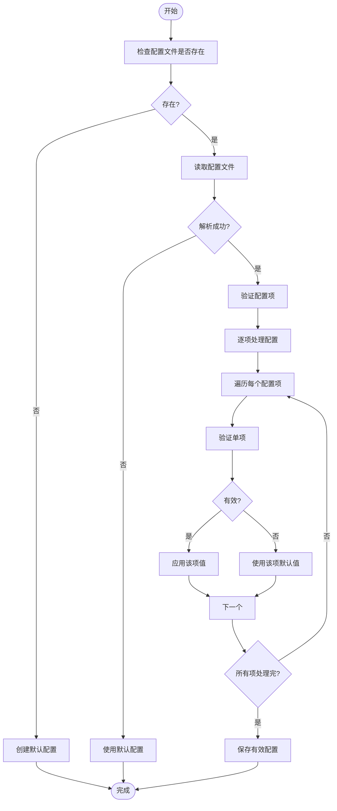

# 高级设置

<cite>
**本文档中引用的文件**  
- [config.py](file://src-python/config.py)
- [EntryWithSaveButton.jsx](file://src-ui/views/app/config_page/setting_section/setting_box/_components/entry_with_save_button/EntryWithSaveButton.jsx)
- [utils.py](file://src-python/utils.py)
</cite>

## 目录
1. [高级配置选项](#高级配置选项)
2. [EntryWithSaveButton实现机制](#entrywithsavebutton实现机制)
3. [配置验证逻辑](#配置验证逻辑)
4. [配置文件手动编辑注意事项](#配置文件手动编辑注意事项)
5. [恢复默认设置的安全机制](#恢复默认设置的安全机制)

## 高级配置选项

本节详细说明VRCT应用中的高级配置选项，包括日志级别设置、缓存目录自定义、网络代理配置和性能监控参数。

### 日志级别设置

系统使用Python标准库`logging`模块进行日志管理。通过`setupLogger`函数配置日志记录器，支持INFO级别以上的日志输出。日志文件采用旋转文件处理器（RotatingFileHandler），当文件大小达到10MB时自动轮转，保留1个备份文件。日志格式包含时间戳、日志器名称、日志级别和消息内容。

### 缓存目录自定义

缓存目录路径由`PATH_LOCAL`属性确定，该属性在应用启动时初始化。如果应用是打包执行（frozen），则使用可执行文件所在目录；否则使用`config.py`文件所在目录。所有配置文件、日志文件和其他持久化数据都存储在此目录下。

### 网络代理配置

网络代理配置主要通过`LMSTUDIO_URL`配置项实现，该配置项指定LM Studio服务的URL地址，默认值为`http://127.0.0.1:1234/v1`。此配置允许用户将请求代理到本地或其他网络位置的LM Studio服务。此外，系统通过`isConnectedNetwork`函数检查网络连接状态，默认使用Google主页作为检测目标，超时时间为3秒。

### 性能监控参数

系统包含多个性能监控相关参数：
- `WATCHDOG_TIMEOUT`：看门狗超时时间，设置为60秒
- `WATCHDOG_INTERVAL`：看门狗检查间隔，设置为20秒
- 通过`threading.Timer`实现配置保存的防抖机制，防抖时间为2秒
- 计算设备列表通过`getComputeDeviceList`函数获取，支持CPU和CUDA设备

**Section sources**
- [config.py](file://src-python/config.py#L753-L756)
- [utils.py](file://src-python/utils.py#L59-L68)

## EntryWithSaveButton实现机制

`EntryWithSaveButton`组件实现了带确认机制的敏感配置修改，防止无效值提交。该组件结合了输入框和保存按钮，确保用户在修改配置后需要显式确认才能保存更改。

### 组件结构

`EntryWithSaveButton`是一个React函数组件，包含以下主要部分：
- `_Entry`输入框组件，用于接收用户输入
- 保存按钮，点击后触发保存操作
- 加载状态指示器，在保存过程中显示

### 确认机制

组件通过状态管理实现确认机制。当用户在输入框中输入内容时，`onChangeFunction`被调用，但不会立即保存。只有当用户点击保存按钮时，`saveFunction`才会被触发，此时才会真正执行保存操作。这种设计确保了用户可以先预览修改内容，确认无误后再进行保存。

### 防止无效值提交

组件通过禁用状态防止在保存过程中提交新值。当保存操作正在进行时（状态为"pending"），输入框和保存按钮都会被禁用，防止用户在前一次保存完成前提交新的修改。这避免了并发修改可能导致的数据不一致问题。

**Diagram sources**
- [EntryWithSaveButton.jsx](file://src-ui/views/app/config_page/setting_section/setting_box/_components/entry_with_save_button/EntryWithSaveButton.jsx#L7-L32)

**Section sources**
- [EntryWithSaveButton.jsx](file://src-ui/views/app/config_page/setting_section/setting_box/_components/entry_with_save_button/EntryWithSaveButton.jsx#L7-L32)

## 配置验证逻辑

系统通过`config.py`中的`ValidatedProperty`描述符和各种验证函数实现复杂的配置参数格式校验规则。

### 基础验证机制

系统使用两种主要的属性描述符进行配置管理：
- `ManagedProperty`：用于简单类型的属性管理，支持类型检查和允许值列表验证
- `ValidatedProperty`：用于复杂类型的属性管理，通过自定义验证函数进行验证

### 复杂参数格式校验

#### 代理地址验证

代理地址（如`LMSTUDIO_URL`）的验证主要通过URL格式检查。虽然代码中没有直接的URL验证函数，但系统在使用这些地址时会通过HTTP请求进行间接验证。如果提供的URL无法访问，相关功能将无法正常工作。

#### 端口范围验证

端口配置（如`OSC_PORT`、`WEBSOCKET_PORT`）通过`ManagedProperty`的类型检查实现。这些属性被定义为整数类型，确保用户不能输入非数字值。虽然没有明确的范围限制，但在实际使用中，系统会处理无效端口导致的绑定异常。

### 字典结构验证

系统使用`validateDictStructure`函数验证复杂字典结构的完整性。该函数递归检查字典的键和值类型是否符合预期结构：

**Diagram sources**
- [utils.py](file://src-python/utils.py#L24-L57)

**Section sources**
- [config.py](file://src-python/config.py#L305-L335)
- [utils.py](file://src-python/utils.py#L24-L57)

## 配置文件手动编辑注意事项

虽然系统提供了图形界面进行配置管理，但用户也可以直接编辑`config.json`文件进行手动配置。以下是手动编辑时需要注意的事项。

### 文件结构

配置文件采用JSON格式，包含所有可序列化的配置项。文件结构与`Config`类中的`_config_data`字典完全对应。每个配置项的键名与类属性名一致（不带前导下划线）。

### 编辑安全

直接编辑配置文件存在以下风险：
- 语法错误：JSON格式错误会导致文件无法解析
- 类型错误：值的类型不符合预期会导致配置被忽略
- 结构错误：字典结构不符合预期会导致验证失败

### 推荐编辑实践

1. **备份原文件**：在编辑前备份原始`config.json`文件
2. **使用JSON验证工具**：编辑时使用支持JSON验证的编辑器
3. **逐项修改**：每次只修改一个配置项，便于定位问题
4. **重启应用**：修改后重启应用以确保配置正确加载

### 特殊配置项

某些配置项在手动编辑时需要特别注意：
- `AUTH_KEYS`：包含API密钥，应确保值为字符串类型
- `HOTKEYS`：包含快捷键设置，应确保结构完整
- `SELECTED_YOUR_LANGUAGES`和`SELECTED_TARGET_LANGUAGES`：包含语言选择，应确保语言和国家代码有效

**Section sources**
- [config.py](file://src-python/config.py#L1001-L1017)

## 恢复默认设置的安全机制

系统提供了多种机制来恢复默认设置，确保在配置出现问题时能够安全恢复。

### 初始化默认值

`Config`类的`init_config`方法设置了所有配置项的默认值。这些默认值在以下情况下会被应用：
- 首次运行应用时
- 配置文件不存在时
- 配置文件为空时

### 错误恢复机制

系统在加载配置时实现了健壮的错误处理机制：
- **配置文件读取错误**：如果配置文件存在但无法读取，系统会使用默认值并记录错误
- **单个配置项错误**：如果某个配置项的值无效，系统会忽略该配置项并使用默认值，但继续加载其他配置项
- **配置保存错误**：如果保存配置失败，系统会记录错误但不影响其他功能

### 防抖保存机制

为了防止频繁的磁盘I/O操作，系统实现了防抖保存机制：
- 当配置项被修改时，启动一个2秒的定时器
- 如果在2秒内有其他配置修改，定时器会被重置
- 2秒内无新修改时，配置才会被写入文件

这种机制既保证了配置的持久化，又避免了频繁的文件写操作影响性能。

### 安全恢复流程

当配置出现问题时，推荐的安全恢复流程如下：
1. 关闭应用
2. 备份当前的`config.json`文件
3. 删除`config.json`文件
4. 重新启动应用，系统将创建新的默认配置文件
5. 逐步恢复必要的自定义配置

**Diagram sources**
- [config.py](file://src-python/config.py#L541-L558)
- [config.py](file://src-python/config.py#L1001-L1017)

**Section sources**
- [config.py](file://src-python/config.py#L541-L558)
- [config.py](file://src-python/config.py#L1001-L1017)