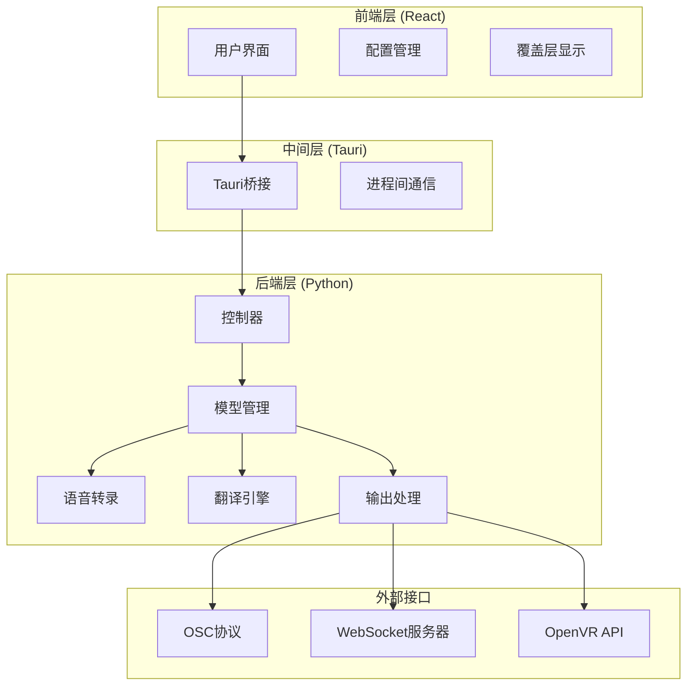
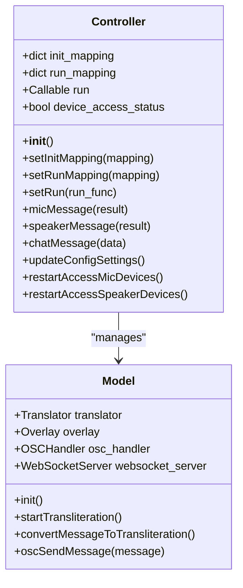
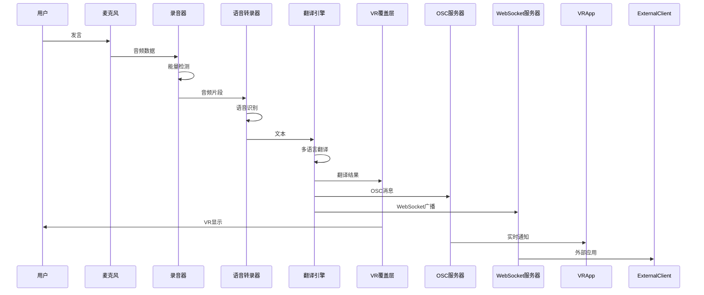

# VRCT项目系统概述

<cite>
**本文档引用的文件**
- [README.md](file://README.md)
- [package.json](file://package.json)
- [src-python/controller.py](file://src-python/controller.py)
- [src-python/model.py](file://src-python/model.py)
- [src-python/config.py](file://src-python/config.py)
- [src-python/mainloop.py](file://src-python/mainloop.py)
- [src-python/docs/仕様書.md](file://src-python/docs/仕様書.md)
- [src-python/models/transcription/transcription_recorder.py](file://src-python/models/transcription/transcription_recorder.py)
- [src-python/models/translation/translation_translator.py](file://src-python/models/translation/translation_translator.py)
- [src-python/models/overlay/overlay.py](file://src-python/models/overlay/overlay.py)
- [src-python/models/websocket/websocket_server.py](file://src-python/models/websocket/websocket_server.py)
- [src-python/models/osc/osc.py](file://src-python/models/osc/osc.py)
- [src-tauri/src/main.rs](file://src-tauri/src/main.rs)
- [src-ui/views/App.jsx](file://src-ui/views/App.jsx)
- [index.html](file://index.html)
</cite>

## 目录
1. [项目简介](#项目简介)
2. [核心目标与应用场景](#核心目标与应用场景)
3. [系统架构概览](#系统架构概览)
4. [技术栈与框架](#技术栈与框架)
5. [核心组件分析](#核心组件分析)
6. [数据流与处理流程](#数据流与处理流程)
7. [用户群体与价值主张](#用户群体与价值主张)
8. [架构决策背景](#架构决策背景)
9. [总结](#总结)

## 项目简介

VRCT（Virtual Reality Chat Translator）是一个专为虚拟现实环境设计的实时语音翻译与转录工具。该项目旨在消除VR社交平台（特别是VRChat）中的语言障碍，为全球用户提供无障碍的跨语言交流体验。

VRCT通过先进的AI技术，能够实时将用户的语音输入转换为文本，进行多语言翻译，并将结果以视觉形式展示在VR环境中，同时支持OSC协议和WebSocket通信，实现与VR应用的无缝集成。

## 核心目标与应用场景

### 主要目标

VRCT的核心使命是：
- **消除语言障碍**：为VR社交平台用户提供实时的语言翻译服务
- **提升用户体验**：在虚拟环境中提供直观、即时的沟通方式
- **促进全球化交流**：打破地理和语言限制，构建包容性的虚拟社区

### 应用场景

1. **VR社交平台**：主要针对VRChat等VR社交应用
2. **多语言协作**：跨国团队在虚拟会议中的实时翻译
3. **教育培训**：语言学习环境中的实时反馈
4. **娱乐互动**：游戏和虚拟活动中的跨语言交流

## 系统架构概览

VRCT采用三层架构设计，实现了前后端分离和模块化开发：

**架构图来源**
- [src-python/controller.py](file://src-python/controller.py#L1-L50)
- [src-python/model.py](file://src-python/model.py#L80-L150)
- [src-tauri/src/main.rs](file://src-tauri/src/main.rs#L1-L7)

## 技术栈与框架

### 前端技术栈

- **React 18.3.1**：现代JavaScript框架，提供响应式用户界面
- **Tauri 2.5.0**：跨平台桌面应用框架，连接前端与后端
- **Material-UI 7.0.2**：React UI组件库，确保一致的视觉设计
- **Vite 6.3.4**：快速构建工具链，优化开发体验

### 后端技术栈

- **Python 3.x**：主要编程语言，提供核心业务逻辑
- **faster-whisper**：高性能语音识别引擎
- **CTranslate2**：本地翻译模型，支持离线翻译
- **OpenVR**：VR环境交互API
- **WebSocket**：实时通信协议

### 开发工具链

- **Node.js**：前端构建和包管理
- **PyInstaller**：Python应用打包
- **Git**：版本控制和协作

**章节来源**
- [package.json](file://package.json#L26-L50)
- [src-tauri/Cargo.toml](file://src-tauri/Cargo.toml)

## 核心组件分析

### 1. 控制器层 (Controller)

控制器负责协调各个子系统的工作，提供统一的接口管理：

**图表来源**
- [src-python/controller.py](file://src-python/controller.py#L11-L50)
- [src-python/model.py](file://src-python/model.py#L81-L150)

### 2. 模型层 (Model)

模型层包含所有核心业务逻辑，负责处理音频、翻译和输出：

#### 音频处理模块
- **录音器**：支持麦克风和扬声器输入
- **能量检测**：实时音量监控和阈值检测
- **语音转录**：基于faster-whisper的语音识别

#### 翻译引擎
- **多引擎支持**：DeepL、OpenAI、Google、CTranslate2等
- **模型管理**：自动下载和权重管理
- **语言对适配**：智能选择兼容的翻译引擎

#### 输出处理
- **VR覆盖层**：OpenVR集成，提供视觉反馈
- **OSC通信**：与VR应用的实时消息传递
- **WebSocket服务**：外部客户端连接支持

**章节来源**
- [src-python/model.py](file://src-python/model.py#L150-L300)
- [src-python/models/transcription/transcription_recorder.py](file://src-python/models/transcription/transcription_recorder.py#L1-L100)
- [src-python/models/translation/translation_translator.py](file://src-python/models/translation/translation_translator.py#L1-L100)

### 3. 用户界面层

前端采用现代化的React架构，提供直观的配置界面：

#### 主要功能模块
- **设备管理**：音频设备选择和配置
- **语言设置**：源语言和目标语言配置
- **翻译引擎**：多个翻译服务的选择和认证
- **显示配置**：VR覆盖层的位置和样式设置

#### 实时反馈机制
- **状态监控**：设备连接状态和网络状况
- **进度指示**：模型下载和初始化进度
- **错误处理**：友好的错误提示和恢复建议

**章节来源**
- [src-ui/views/App.jsx](file://src-ui/views/App.jsx#L1-L100)

## 数据流与处理流程

### 音频采集到翻译的完整流程

**流程图来源**
- [src-python/controller.py](file://src-python/controller.py#L254-L400)
- [src-python/model.py](file://src-python/model.py#L656-L750)

### 关键处理节点

1. **音频预处理**：噪声抑制和音量标准化
2. **语音识别**：实时转录和语言检测
3. **翻译处理**：多引擎负载均衡和故障转移
4. **结果格式化**：文本清理和格式化
5. **多渠道输出**：同步发送到多个目标

**章节来源**
- [src-python/mainloop.py](file://src-python/mainloop.py#L1-L100)

## 用户群体与价值主张

### 目标用户群体

#### 主要用户
- **VR社交用户**：活跃于VRChat等平台的用户
- **多语言学习者**：希望在虚拟环境中练习外语
- **国际团队成员**：跨国企业或教育机构的远程工作者

#### 开发者用户
- **VR应用开发者**：需要集成翻译功能的应用
- **插件开发者**：扩展VRCT功能的第三方开发者
- **系统集成商**：企业级VR解决方案提供商

### 核心价值主张

#### 对普通用户
- **无障碍交流**：无需提前学习对方语言即可沟通
- **实时翻译**：即时的语言转换，保持对话流畅性
- **高质量体验**：专业级的翻译准确度和响应速度

#### 对开发者
- **开放API**：丰富的接口支持自定义集成
- **模块化设计**：灵活的组件架构便于扩展
- **跨平台支持**：Windows、macOS、Linux全面兼容

## 架构决策背景

### 为什么选择faster-whisper？

**技术优势**：
- **性能卓越**：比传统whisper快数倍，适合实时应用
- **GPU加速**：充分利用现代显卡计算能力
- **模型轻量化**：支持多种精度级别，适应不同硬件

**实际考量**：
- **延迟要求**：VR环境对低延迟的严格要求
- **资源效率**：在消费级硬件上的良好表现
- **准确性平衡**：在性能和准确度之间找到最佳平衡点

### 多翻译引擎集成的原因

**战略考虑**：
- **可靠性保障**：单一引擎故障时的备用方案
- **成本优化**：根据翻译复杂度选择最经济的引擎
- **质量保证**：不同引擎在特定语言对上的优势互补

**技术实现**：
- **智能路由**：基于语言对和负载情况的动态选择
- **故障转移**：自动切换到备用引擎的机制
- **结果融合**：多引擎结果的综合评估和选择

### Tauri框架的选择

**架构优势**：
- **轻量级**：相比Electron显著减少应用体积
- **安全性**：沙箱环境提供更好的安全保障
- **性能**：原生渲染，更低的系统资源占用

**开发便利性**：
- **跨平台**：一套代码支持多个操作系统
- **热重载**：开发时的快速迭代能力
- **生态系统**：丰富的插件和工具支持

**章节来源**
- [src-python/docs/仕様書.md](file://src-python/docs/仕様書.md#L1-L50)

## 总结

VRCT项目代表了虚拟现实时代语言技术的重要创新。通过精心设计的三层架构，项目成功地将复杂的AI技术转化为易用的VR社交工具。

### 技术亮点

1. **实时性**：毫秒级的语音识别和翻译响应
2. **准确性**：多引擎融合确保翻译质量
3. **可扩展性**：模块化设计支持功能扩展
4. **跨平台**：广泛的硬件和软件兼容性

### 未来发展方向

- **AI能力增强**：集成更先进的自然语言处理技术
- **VR生态整合**：与更多VR平台和应用的深度集成
- **用户体验优化**：更直观的界面和更智能的功能
- **性能持续改进**：在低端硬件上的更好表现

VRCT不仅解决了当前VR社交中的语言障碍问题，更为未来的虚拟世界交流奠定了技术基础。随着VR技术的不断发展，这样的工具将成为构建真正全球化虚拟社区的关键基础设施。